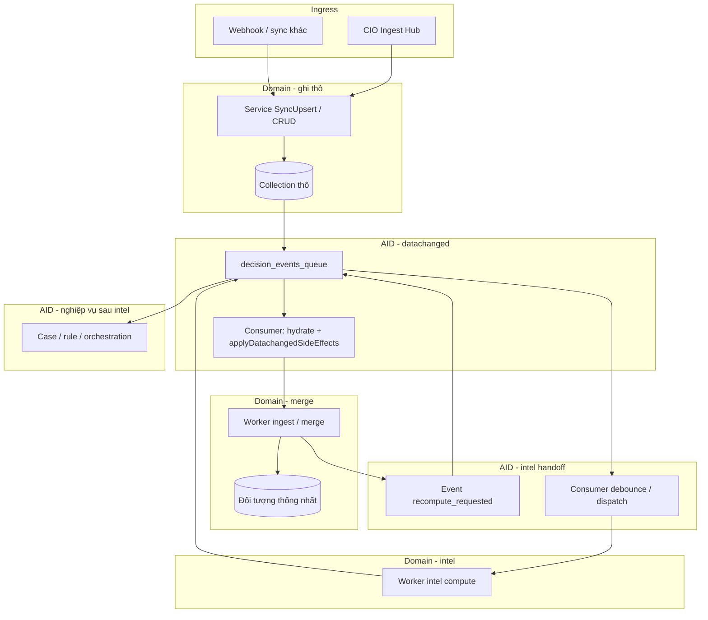

# Khung luồng thống nhất: Ingress → Merge → Intelligence (CIO · Domain · AID)

**Dành cho ai:** Người làm backend / tích hợp luồng dữ liệu và queue. Văn bản dùng thuật ngữ kỹ thuật (ingest, merge, worker, event) — bình thường với tài liệu kiến trúc; đọc kèm [KHUNG_KHUON_MODULE_INTELLIGENCE.md](./KHUNG_KHUON_MODULE_INTELLIGENCE.md) (**mục 0 — bảng thuật ngữ**) nếu cần phân biệt mirror/canonical, intel-run, CIO-T*, pipeline CIX.

**Một câu tóm tắt:** Dữ liệu vào → ghi nguồn thô → (tuỳ miền) gộp thành bản chuẩn → hàng đợi tính intelligence chạy nặng ở **worker domain** → báo lại **AI Decision** cho case/rule — CIO và AID **không** thay domain làm merge hay tính intel nặng.

---

Tài liệu này cố định **một mẫu kiến trúc** để các module (CRM, Order, Conversation/CIX, Ads, …) **cùng ngôn ngữ** khi thiết kế luồng dữ liệu từ ngoài vào, đồng bộ nội bộ, và bàn giao cho AI Decision (AID). **Tham chiếu triển khai chuẩn hiện tại: module CRM.**

---

## 1. Ba thành phần và ranh giới trách nhiệm

| Thành phần | Trách nhiệm | Không làm |
|------------|-------------|-----------|
| **CIO Ingest Hub** | Điểm vào HTTP thống nhất (`POST /cio/ingest` + `domain`), forward tới handler/service domain; payload/filter chuẩn hóa theo từng domain. | Merge đa nguồn vào đối tượng nghiệp vụ chung; tính intelligence; quyết định case/rule. |
| **Domain module** | Sở hữu collection thô + model; **SyncUpsert / CRUD**; sau ghi DB thành công tham gia **`EmitDataChanged`**; **worker domain**: merge (nếu có), tính intel, ghi kết quả; phát event **bàn giao** cho AID. | Tự ý bỏ qua `decision_events_queue` khi luồng đã chuẩn hóa theo AID (trừ ngoại lệ đã ghi trong code). |
| **AI Decision (AID)** | Hạ tầng **`decision_events_queue`**, consumer **hydrate** payload, **`applyDatachangedSideEffects`** (một cửa điều phối), debounce, xếp job domain; xử lý event **recompute / intel_recomputed** cho case, rule, orchestration. | Chứa logic merge nặng hoặc thay domain ghi aggregate nghiệp vụ. |

**Ingress ngoài CIO:** Webhook, job sync, route trực tiếp domain — vẫn **cùng mẫu** sau bước ghi Mongo (thô) và `EmitDataChanged`.

**Đọc thêm (bắt buộc khi sửa luồng CRUD / hook / queue):** [NGUYEN_TAC_LUONG_CRUD_DATACHANGED_AI_DECISION.md](./NGUYEN_TAC_LUONG_CRUD_DATACHANGED_AI_DECISION.md).

### 1.1 Chuẩn kiến trúc: Tách lớp tính toán (intel) khỏi document đồng bộ

**Quyết định (chuẩn dự án):** Lớp **tính toán intelligence** (pipeline rule/LLM, snapshot nhiều lớp, chạy lại) **tách riêng** khỏi document **nghiệp vụ / đồng bộ** chính (mirror nguồn, aggregate sau merge, canonical conversation, …).

- **Tách gồm:** queue job `{domain}_intel_compute` (consumer domain), **collection kết quả** chuyên trách khi cần nhiều phiên bản hoặc payload lớn (ví dụ CIX: `cix_analysis_results`), và event bàn giao AID (`*_intel_recomputed` hoặc tương đương, thường kèm id tham chiếu tới bản ghi kết quả).
- **Không lấy** document thô hoặc canonical **làm nơi duy nhất** chứa toàn bộ output intel nếu cần lịch sử nhiều lần chạy, trace pipeline, audit — tránh phình schema đồng bộ, khó versioning, khó fan-in AID.

**Bổ sung tùy chọn (không thay thế việc tách):**

- **Denormalize nhẹ** lên aggregate cho đọc nhanh (UI, danh sách): ví dụ `currentMetrics.cix` trên `crm_customers` chỉ giữ tín hiệu tóm tắt sau CIX; sau này có thể có snapshot nhỏ trên document canonical hội thoại — luôn nên kèm tham chiếu (`traceId`, id bản ghi intel đầy đủ khi cần join).
- **Timeline người dùng** có thể dùng **activity** (`crm_activity_history` với `Snapshot` tại `activityAt`) — đó là lịch sử hoạt động nghiệp vụ, **khác** với việc “gộp toàn bộ intel vào một document sync”.

| Cách tiếp cận | Khi nào phù hợp |
|---------------|------------------|
| **Tách intel (chuẩn)** | Nhiều lần chạy, pipeline phức tạp, cần id kết quả cho AID, giảm coupling ingest ↔ phân tích |
| **Gộp toàn bộ intel vào một document đồng bộ** | Chỉ khi output rất nhỏ, một phiên bản, không cần lịch sử — thường **không** áp cho CIX / intel CRM đầy đủ |

### 1.2 Mirror / canonical (L1-persist / L2-persist) và định danh

- **L1-persist (mirror):** collection **mirror / thô** sau ingest — nguồn truth theo kênh, dùng để reconcile và làm **đầu vào** tạo canonical.
- **L2-persist (canonical):** document **đã merge** trong hệ — **`uid`** và **`links`** chuẩn cho tương tác giữa module; có thể có **`links` mirror→mirror** trên bản mirror để merge suy ra **`links` canonical→canonical**.
- **Bốn vai trò field** (`_id`, `uid`, `sourceIds`, `links`) là **khung chung**; trên mirror và canonical **kỳ vọng khác nhau** (xem [unified-data-contract.md](../../docs-shared/architecture/data-contract/unified-data-contract.md) §1.7, [HUONG_DAN_IDENTITY_LINKS.md](./HUONG_DAN_IDENTITY_LINKS.md) mục 2.1). *Không nhầm với bước “L1/L2/L3” trong **pipeline rule CIX** hoặc trường BSON `layer1`/`layer2` CRM — xem [KHUNG_KHUON_MODULE_INTELLIGENCE.md](./KHUNG_KHUON_MODULE_INTELLIGENCE.md) mục 0.*

### 1.3 Chuẩn «luôn lưu» intelligence (persist có kiểm soát)

**Mục tiêu:** Mỗi lần pipeline intel **kết thúc** (thành công hoặc thất bại sau cùng của một job/run) phải để lại **dữ liệu có thể truy vết** — không chỉ cập nhật «trong đầu» worker rồi mất khi crash, và không chỉ dựa vào log text.

**Hai thành phần lưu intel (bắt buộc xác định rõ theo miền):**

| Thành phần | Vai trò | Ghi chú |
|------------|---------|--------|
| **Bản ghi chạy intel** | Lịch sử nhiều phiên bản, audit, so sánh trước–sau, debug AID | Collection riêng (vd. `cix_analysis_results`, CRM: `crm_customer_intel_runs`), **một document mỗi lần chạy có ý nghĩa** hoặc mỗi job terminal |
| **Read model intel** | UI, sort, context packet, đọc nhanh | Chỉ **tóm tắt / denormalize** trên canonical / aggregate; luôn có thể truy ngược **bản ghi chạy intel** qua `lastIntelResultId` / `intelRunUid` / `parentJobId` (theo data contract) |

**Quy tắc chung (khuyến nghị tối thiểu trên document bản ghi chạy intel):**

- Khóa nghiệp vụ: `ownerOrganizationId`, khóa canonical miền (`unifiedId`, `orderUid`, `conversationId`, … — thống nhất từng domain).
- Thời gian: `computedAt` / `failedAt` (thời điểm worker kết thúc run — audit).
- **Thứ tự nghiệp vụ (khi merge/event không FIFO):** mốc **thay đổi nguồn** trên payload (ví dụ `causalOrderingAtMs` unix ms) → copy vào job `*_intel_compute` → ghi trên **bản ghi chạy intel** (ví dụ `causalOrderingAt`); tie-break bằng số monotonic trên canonical (ví dụ `intelSequence`). Sort lịch sử đề xuất: `(causalOrderingAt ↑, intelSequence ↑, _id)`.
- Trạng thái: `status` (`success` | `failed` | `skipped` khi idempotent noop có ghi nhận).
- Liên kết: `parentJobId` / `parentDecisionEventId` / `traceId` (tuỳ miền đã có).
- **Thành công:** `outputSummary` hoặc full `output` (nếu kích thước cho phép); nếu payload lớn → lưu pointer (file/grid) **nhưng vẫn có** dòng meta trên A.
- **Thất bại:** `errorCode`, `errorMessage` tóm tắt; job queue (`*_intel_compute`) giữ `processError` / retry như hiện tại **không thay thế** bản ghi chạy intel nếu cần báo cáo lịch sử lỗi.

**Hiện trạng từng miền (định hướng chỉnh cho khớp chuẩn):**

- **CIX:** Đã có collection kết quả (`cix_analysis_results`) + event fan-in AID — **mẫu chuẩn bản ghi chạy intel**.
- **CRM customer intel:** Đã có **`crm_customer_intel_runs`** (mỗi lần `RunCrmIntelComputeJob` terminal ghi run + `crm_customers.intelLastRunId` / `intelLastComputedAt`; `$inc intelSequence` khi persist thành công một khách). Payload **`causalOrderingAtMs`** từ merge (`updatedAtNew` / fallback `createdAt` queue), defer CRM refresh (`ExtractUpdatedAtFromDoc`), consumer chép vào job `refresh`; debounce ingest gộp **max** causal trong cửa sổ — xem `aidecision/crmqueue`, `service.crm.intel_run.go`, `eventintake/crm_intel_after_ingest_defer.go`. Vẫn có **activity snapshot** (`crm_activity_history`) cho timeline nghiệp vụ — bổ sung cho intel run, không thay thế.
- **Order intel / Meta ads intel:** Giữ pattern job + collection intel hiện có; bảo đảm mỗi run terminal có **dấu vết** tương đương (meta đã có nhánh `meta_ads_intel` / debounce — rà lại có đủ meta run khi cần audit).

**Không làm:** Gộp toàn bộ chuỗi output LLM/rule chỉ vào một field sâu trên document đồng bộ **mà không** có **bản ghi chạy intel** khi miền đã quy ước cần lịch sử (trái mục 1.1).

**Pha triển khai CRM (cập nhật hiện trạng):**

1. **P0 — Đã có:** Worker: persist run + pointer + causal/sequence như trên.
2. **P1 — Đã có:** `GET /api/v1/customers/:unifiedId/intel-runs` (phân trang `page`/`limit`/`newestFirst`); profile đầy đủ có `intelSummary` (`lastRunId`, `lastComputedAt`, `sequence`).
3. **P2 — Thống nhất:** Rà soát mọi đường vào intel (API recalculate trực tiếp, v.v.) đều đi qua **cùng** đường finalize như worker khi cần đủ dấu vết **bản ghi chạy intel**.

---

## 2. Mẫu ba pha ingress (chuẩn hướng dẫn)

*Tên **Pha ghi thô** / **Pha merge** / **Pha intel** tránh trùng với **CIO-T1/T2/T3** (lọc event `cio_events`) và với **bản ghi chạy intel** — xem [KHUNG_KHUON_MODULE_INTELLIGENCE.md](./KHUNG_KHUON_MODULE_INTELLIGENCE.md) mục 0.*

### Pha ghi thô — Dữ liệu thô vào DB + DataChanged

1. Nguồn ngoài → (tuỳ chọn CIO) → **Service domain** → **Upsert** vào **collection mirror / thô**.
2. Base layer / hook → **`events.EmitDataChanged`** (theo policy collection: ghi `decision_events_queue` hay không — xem `aidecision/datachangedemit/emit_policy.go`, `datachangedrouting` YAML `emit_to_decision_queue`, `hooks/datachanged_emit_filter.go`, `source_sync_registry.go`).
3. Consumer AID → **`applyDatachangedSideEffects`** → **chỉ điều phối**: xếp **job nhẹ** cho domain (queue ingest, enqueue intel, debounce ads, …), **không** merge nặng tại đây.

### Pha merge — Gộp đa nguồn (nếu domain cần) + bàn giao “sẵn sàng tính intel”

1. **Worker domain** đọc queue (ví dụ `crm_pending_merge` — merge **mirror → canonical** CRM, khác CIO ingest).
2. **Merge / touchpoint** vào **đối tượng thống nhất** trong domain (ví dụ `crm_customers` + `unifiedId`).
3. Sau khi merge thành công → domain (hoặc worker) phát event vào AID kiểu **“yêu cầu tính lại intelligence”** (ví dụ `crm.intelligence.recompute_requested` → debounce → `crm_intel_compute`).

**Quy ước hiện tại (CRM):** Logic merge nằm **trong package domain** (`crm/service`), không tách module ingest riêng; sau này có thể thêm **registry + config nguồn** mà vẫn giữ **nghiệp vụ merge** tại domain.

### Pha intel — Tính intelligence + báo cáo về AID

1. **Worker domain** chạy job intel (refresh metrics, recalculate, snapshot nhiều lớp — tuỳ domain).
2. Ghi kết quả vào **collection kết quả intel** (chuẩn — xem mục 1.1); chỉ **cập nhật có kiểm soát** lên document aggregate (mirror/canonical) khi cần **snapshot tóm tắt** cho UI.
3. Phát event **intel đã cập nhật** (ví dụ `crm_intel_recomputed`) để AID: cập nhật case, context packet, rule, feed.

**Hợp đồng ID / envelope / event:** Khi chạm payload queue, `sourceIds`, `links`, case — tuân [docs-shared/architecture/data-contract/unified-data-contract.md](../../docs-shared/architecture/data-contract/unified-data-contract.md) và [HUONG_DAN_IDENTITY_LINKS.md](./HUONG_DAN_IDENTITY_LINKS.md).

### 2.1 Bố trí bốn vai trò field ID (data contract) theo pha ingress và theo thành phần

Hợp đồng quy định **bốn vai trò field**: (1) `_id` lưu trữ, (2) `uid` canonical, (3) `sourceIds` ID ngoài, (4) `links` quan hệ — xem mục 1.5–1.6 trong [unified-data-contract.md](../../docs-shared/architecture/data-contract/unified-data-contract.md). *Đây là “bốn lớp” **loại field**, khác với mirror/canonical (L1-persist/L2-persist).* Khung luồng CIO · Domain · AID **không thay thế** hợp đồng; chỉ quy định **ai gắn / khi nào** để các module đồng bộ.

| Vai trò field | Ý nghĩa ngắn | **Pha ghi thô** | **Pha merge** | **Pha intel** | **AID** (queue / hydrate / case) |
|-----|----------------|-------------------------------------|-------------------------------|-------------------|----------------------------------|
| **(1) `_id`** | Khóa Mongo nội bộ | Do driver / upsert; **không** đưa ra API hay payload contract công khai | Giữ nguyên theo document; merge thường không đổi `_id` bản ghi đích | Không đổi vai trò | Event có thể mang `normalizedRecordUid` (hex ObjectID) để **đọc lại document** — đó là **tham chiếu nội bộ**, không thay `uid` public |
| **(2) `uid` / canonical** | ID chuẩn hệ (`cust_*`, `ord_*`, …) | **Domain (sync/upsert):** gán khi tạo mới hoặc bảo đảm idempotent theo helper CIO/domain; ưu tiên cùng prefix với entity | **Domain (merge):** bản aggregate có **một** canonical (CRM: `uid` mới / `unifiedId` legacy — đang migration theo [HUONG_DAN_IDENTITY_LINKS](./HUONG_DAN_IDENTITY_LINKS.md)) | Intel đọc/ghi theo **canonical** để join snapshot & case | Payload event nên dùng **`uid` hoặc khóa đã resolve** (vd `unifiedId` trong luồng CRM hiện tại) sau hydrate — tránh leak `_id` ra contract |
| **(3) `sourceIds`** | Map ID nguồn ngoài → reconcile | **Domain:** điền nhánh nguồn khi ingest (POS id, FB psid, …) từ payload thô | **Domain (merge):** gộp / cập nhật map; dùng cho `ResolveUnifiedId` / resolver | Ít thay đổi; có thể bổ sung nếu intel phát hiện thêm khóa | Chỉ mang trong payload khi cần trace/debug; join nghiệp vụ ưu tiên đã resolve sang canonical |
| **(4) `links`** | Tham chiếu entity khác (đã resolve hoặc `externalRefs`) | **Domain:** set khi đã biết quan hệ (vd order → customer); có thể để trống rồi backfill sau merge | **Domain:** cập nhật khi merge khách / gắn đơn–khách | Intel có thể đọc `links` để enrich snapshot | Case / context packet: dùng **`links.*.uid`** khi đã resolved |

**Nguyên tắc gọn:**

- **CIO** không “phát minh” `uid` thay domain: CIO chuyển tiếp body; **gán canonical + `sourceIds`** là trách nhiệm **service domain** (thường trong `SyncUpsert` / flatten từ POS).
- **AID không merge identity:** consumer chỉ **hydrate** từ DB theo `_id` hex hoặc field đã có; resolve `customerId` → `unifiedId`/`uid` nếu có **gọi service CRM** là ngoại lệ có kiểm soát (vd debounce intel), không phải chỗ ghi `sourceIds` lần đầu.
- **Pha merge** là nơi **ổn định đa nguồn**: `sourceIds` đầy đủ + một canonical cho aggregate — đúng với mục 1.6 hợp đồng (entity đa nguồn).

---

## 3. Sơ đồ tổng (tương đương CRM)

---

## 4. Tham chiếu code — CRM (implementation chuẩn)

| Bước | Vị trí code (gợi ý) |
|------|---------------------|
| Điều phối CIO đa domain | `api/internal/api/cio/handler/handler.cio.ingest.go` |
| Xếp job merge queue từ datachanged | `api/internal/api/crm/datachanged/merge_from_datachanged.go` — `EnqueueCrmMergeFromDataChange` |
| Consumer một cửa side-effect | `api/internal/api/aidecision/worker/worker.aidecision.datachanged_side_effects.go` — `applyDatachangedSideEffects` |
| Worker merge | `api/internal/worker/crm_merge_worker.go` → `crm/service/service.crm.merge_apply.go` — `ApplyCrmMergeFromSourceDocument` |
| Sau merge queue → yêu cầu intel | `notify_after_crm_merge.go` → `aidecision/crmqueue` — `EmitCrmIntelligenceRecomputeRequested` (kèm `causalOrderingAtMs`) |
| Persist lịch sử intel khách | `service.crm.intel_run.go` — `persistCrmCustomerIntelAfterJob` |
| API đọc lịch sử intel + `intelSummary` profile | `crm/handler/handler.crm.customer.go` — `HandleListIntelRuns`; `service.crm.fullprofile.go` |
| Debounce CRM intel sau ingest | `api/internal/api/aidecision/eventintake/crm_intel_after_ingest_defer.go` — gộp max `causalOrderingAtMs` |
| Job intel | `api/internal/api/crm/service/service.crm.intel_compute.go` — `RunCrmIntelComputeJob`; worker `crm/worker/worker.crm.intel_compute.go` |
| Báo intel xong cho AID | `api/internal/api/aidecision/intelrecomputed/`; case `service.aidecision.crm_intel_cases.go` |
| Registry collection → prefix event | `api/internal/api/aidecision/hooks/source_sync_registry.go` |

---

## 5. Mức khớp module khác (kỳ vọng vs hiện trạng)

| Module | Pha ghi thô | Pha merge (thống nhất) | Pha intel |
|--------|-------------|-------------------------|-----------|
| **CRM** | Khớp | Khớp (`crm_customers`) | Khớp |
| **Order intel** | `pc_pos_orders` (Pancake) → chiếu **`order_canonical`** | 1:1 canonical (`source` + `sourceRecordMongoId`); không merge đa nguồn | Khớp — xem [PHUONG_AN_DOMAIN_ORDER_KHOP_KHUNG_CIO_AID.md](./PHUONG_AN_DOMAIN_ORDER_KHOP_KHUNG_CIO_AID.md) |
| **CIX / conversation** | Khớp (`fb_message_items` → enqueue) | Trọng tâm hội thoại, không qua `crm_customers` trước CIX | Khớp tương đối |
| **Meta Ads** | Khớp (insight / entity) | **Khác** — thực thể campaign/ad/…, debounce trong meta hooks | Khớp góc độ bàn giao AID |

Khi **mở rộng nguồn** (Shopee, TikTok, …): áp dụng **cùng Pha ghi thô**; **Pha merge** chỉ bắt buộc nếu domain có **đối tượng thống nhất** cần merge (như khách). **Pha intel** luôn thuộc worker domain + event về AID.

---

## 6. Checklist khi thêm module hoặc nguồn mới

1. **Collection thô** đã đăng ký `global` / `RegistryCollections`?
2. **CIO `domain`** hoặc route ingest có map tới handler/service đúng?
3. Sau upsert có **`EmitDataChanged`** đúng policy (không thêm `OnDataChanged` tùy tiện — xem nguyên tắc CRUD)?
4. **`applyDatachangedSideEffects`** có nhánh gọi domain (queue mới hoặc mở rộnh `switch` có kiểm soát)?
5. Nếu cần merge: worker + queue **trong domain**; AID chỉ nhận event **sau merge** để xếp intel?
6. Intel xong: có event **bàn giao ngược** AID (case / rule) và payload tuân data contract?
7. Cập nhật **`source_sync_registry.go`** (comment bảng) khi thêm collection sync quan trọng cho pipeline?
8. **Bốn vai trò field ID:** Pha ghi thô đã có `sourceIds` (và `uid` nếu quy ước entity)? Pha merge đã gộp map + canonical đúng [unified-data-contract](../../docs-shared/architecture/data-contract/unified-data-contract.md)? Payload AID / case không lộ `_id` ra contract công khai?
9. **Intel:** Đã **tách** job + kết quả đầy đủ khỏi document mirror/sync (mục 1.1)? Mọi field intel trên aggregate chỉ là **tóm tắt / denormalize** có lý do (UI, sort), không thay thế collection kết quả khi cần lịch sử?
10. **Persist intel (mục 1.3):** Mỗi lần chạy intel kết thúc có **bản ghi chạy intel** hoặc lý do **skipped** có document; canonical có **pointer** tới lần chạy mới nhất?
11. **Thứ tự lịch sử:** Khi có nhiều nguồn / queue không FIFO, đã truyền **mốc thời gian nghiệp vụ** (payload → job) và có **tie-break** monotonic trên entity (pattern CRM) khi cần sort đúng nghiệp vụ?

---

## 7. Hướng mở rộng (không bắt buộc ngay)

- **Config-driven ingest:** lớp điều phối (registry) đọc cấu hình nguồn → gọi handler **đăng ký bởi domain**; **logic merge** vẫn ở domain.
- Chuẩn hóa **canonical document** (order / message / insight) trước intel nếu đa nguồn cùng miền.

---

## 8. Liên kết nhanh

- [NGUYEN_TAC_LUONG_CRUD_DATACHANGED_AI_DECISION.md](./NGUYEN_TAC_LUONG_CRUD_DATACHANGED_AI_DECISION.md)
- [THIET_KE_TRUNG_TAM_CHI_HUY_AI_DECISION.md](./THIET_KE_TRUNG_TAM_CHI_HUY_AI_DECISION.md)
- [THIET_KE_MODULE_CIO.md](./THIET_KE_MODULE_CIO.md)
- [HUONG_DAN_IDENTITY_LINKS.md](./HUONG_DAN_IDENTITY_LINKS.md) — `uid`, `unifiedId`, `links`, resolver
- Unified data contract: [unified-data-contract.md](../../docs-shared/architecture/data-contract/unified-data-contract.md) — mục 1.5–1.7 (bốn vai trò field + đa nguồn + mirror/canonical L1-persist/L2-persist)
- Tiền tố, tên field, event/queue: [uid-field-naming.md](../../docs-shared/architecture/data-contract/uid-field-naming.md)
- Chi tiết model: [identity-links-model.md](../../docs-shared/architecture/data-contract/identity-links-model.md)

---

*Tài liệu khung — cập nhật 2026-04-06: mục 1.3 chuẩn persist intelligence; mục 1.1 tách intel khỏi document đồng bộ; mục 1.2 mirror/canonical + định danh. **2026-04-06 (bổ sung):** CRM bản ghi chạy intel + `causalOrderingAt` / `intelSequence` / payload `causalOrderingAtMs`. **2026-04-07:** Đổi tên pha **Pha ghi thô / Pha merge / Pha intel**; **bản ghi chạy intel** / **read model intel**; **L1-persist/L2-persist**; bốn **vai trò field**. Cập nhật tiếp khi luồng domain lệch khỏi mẫu hoặc khi tách ingest/registry có cấu hình.*
