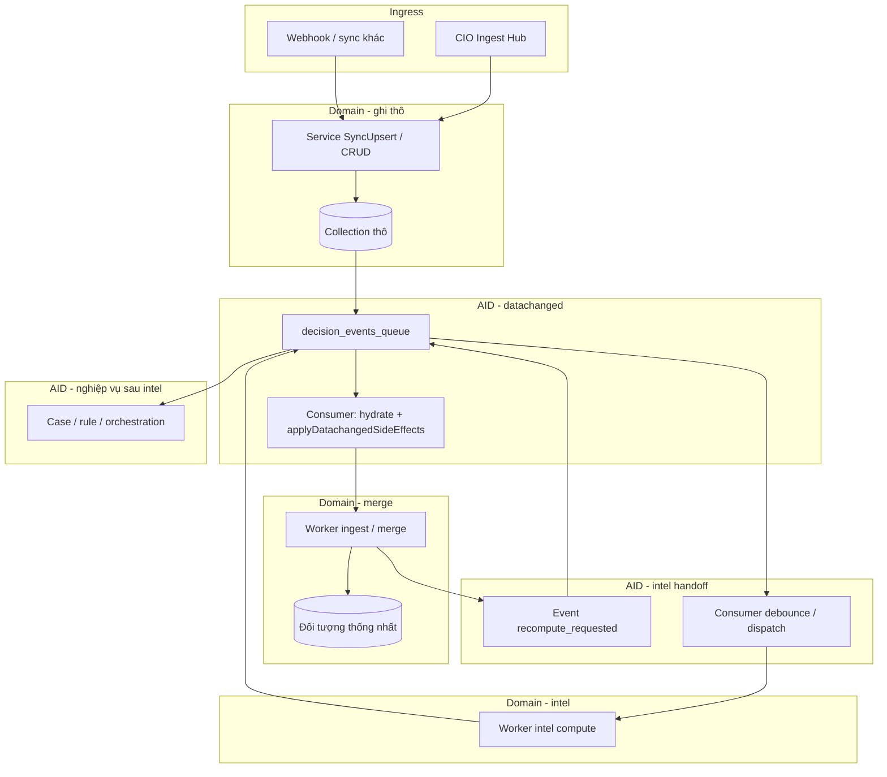

# Khung luồng thống nhất: Ingress → Merge → Intelligence (CIO · Domain · AID)

Tài liệu này cố định **một mẫu kiến trúc** để các module (CRM, Order, Conversation/CIX, Ads, …) **cùng ngôn ngữ** khi thiết kế luồng dữ liệu từ ngoài vào, đồng bộ nội bộ, và bàn giao cho AI Decision (AID). **Tham chiếu triển khai chuẩn hiện tại: module CRM.**

---

## 1. Ba thành phần và ranh giới trách nhiệm

| Thành phần | Trách nhiệm | Không làm |
|------------|-------------|-----------|
| **CIO Ingest Hub** | Điểm vào HTTP thống nhất (`POST /cio/ingest` + `domain`), forward tới handler/service domain; payload/filter chuẩn hóa theo từng domain. | Merge đa nguồn vào đối tượng nghiệp vụ chung; tính intelligence; quyết định case/rule. |
| **Domain module** | Sở hữu collection thô + model; **SyncUpsert / CRUD**; sau ghi DB thành công tham gia **`EmitDataChanged`**; **worker domain**: merge (nếu có), tính intel, ghi kết quả; phát event **bàn giao** cho AID. | Tự ý bỏ qua `decision_events_queue` khi luồng đã chuẩn hóa theo AID (trừ ngoại lệ đã ghi trong code). |
| **AI Decision (AID)** | Hạ tầng **`decision_events_queue`**, consumer **hydrate** payload, **`applyDatachangedSideEffects`** (một cửa điều phối), debounce, xếp job domain; xử lý event **recompute / intel_recomputed** cho case, rule, orchestration. | Chứa logic merge nặng hoặc thay domain ghi aggregate nghiệp vụ. |

**Ingress ngoài CIO:** Webhook, job sync, route trực tiếp domain — vẫn **cùng mẫu** sau bước ghi Mongo (thô) và `EmitDataChanged`.

**Đọc thêm (bắt buộc khi sửa luồng CRUD / hook / queue):** [NGUYEN_TAC_LUONG_CRUD_DATACHANGED_AI_DECISION.md](./NGUYEN_TAC_LUONG_CRUD_DATACHANGED_AI_DECISION.md).

---

## 2. Mẫu ba pha (chuẩn hướng dẫn)

### Pha A — Dữ liệu thô vào DB + DataChanged

1. Nguồn ngoài → (tuỳ chọn CIO) → **Service domain** → **Upsert** vào **collection mirror / thô**.
2. Base layer / hook → **`events.EmitDataChanged`** (theo policy collection: ghi `decision_events_queue` hay không — xem `aidecision/hooks/datachanged_emit_per_collection.go`, `source_sync_registry.go`).
3. Consumer AID → **`applyDatachangedSideEffects`** → **chỉ điều phối**: xếp **job nhẹ** cho domain (queue ingest, enqueue intel, debounce ads, …), **không** merge nặng tại đây.

### Pha B — Merge đa nguồn (nếu domain cần) + bàn giao “sẵn sàng tính intel”

1. **Worker domain** đọc queue (ví dụ `crm_pending_ingest`).
2. **Merge / touchpoint** vào **đối tượng thống nhất** trong domain (ví dụ `crm_customers` + `unifiedId`).
3. Sau khi merge thành công → domain (hoặc worker) phát event vào AID kiểu **“yêu cầu tính lại intelligence”** (ví dụ `crm.intelligence.recompute_requested` → debounce → `crm_intel_compute`).

**Quy ước hiện tại (CRM):** Logic merge nằm **trong package domain** (`crm/service`), không tách module ingest riêng; sau này có thể thêm **registry + config nguồn** mà vẫn giữ **nghiệp vụ merge** tại domain.

### Pha C — Tính intelligence + báo cáo về AID

1. **Worker domain** chạy job intel (refresh metrics, recalculate, snapshot nhiều lớp — tuỳ domain).
2. Ghi kết quả vào collection/domain model.
3. Phát event **intel đã cập nhật** (ví dụ `crm_intel_recomputed`) để AID: cập nhật case, context packet, rule, feed.

**Hợp đồng ID / envelope / event:** Khi chạm payload queue, `sourceIds`, `links`, case — tuân [docs-shared/architecture/data-contract/unified-data-contract.md](../../docs-shared/architecture/data-contract/unified-data-contract.md) và [HUONG_DAN_IDENTITY_LINKS.md](./HUONG_DAN_IDENTITY_LINKS.md).

### 2.1 Bố trí bốn lớp ID (data contract) theo pha và theo thành phần

Hợp đồng quy định **bốn lớp**: (1) `_id` lưu trữ, (2) `uid` canonical, (3) `sourceIds` ID ngoài, (4) `links` quan hệ — xem mục 1.5–1.6 trong [unified-data-contract.md](../../docs-shared/architecture/data-contract/unified-data-contract.md). Khung luồng CIO · Domain · AID **không thay thế** hợp đồng; chỉ quy định **ai gắn / khi nào** để các module đồng bộ.

| Lớp | Ý nghĩa ngắn | **Pha A** (ghi thô + datachanged) | **Pha B** (merge / aggregate) | **Pha C** (intel) | **AID** (queue / hydrate / case) |
|-----|----------------|-------------------------------------|-------------------------------|-------------------|----------------------------------|
| **(1) `_id`** | Khóa Mongo nội bộ | Do driver / upsert; **không** đưa ra API hay payload contract công khai | Giữ nguyên theo document; merge thường không đổi `_id` bản ghi đích | Không đổi vai trò | Event có thể mang `normalizedRecordUid` (hex ObjectID) để **đọc lại document** — đó là **tham chiếu nội bộ**, không thay `uid` public |
| **(2) `uid` / canonical** | ID chuẩn hệ (`cust_*`, `ord_*`, …) | **Domain (sync/upsert):** gán khi tạo mới hoặc bảo đảm idempotent theo helper CIO/domain; ưu tiên cùng prefix với entity | **Domain (merge):** bản aggregate có **một** canonical (CRM: `uid` mới / `unifiedId` legacy — đang migration theo [HUONG_DAN_IDENTITY_LINKS](./HUONG_DAN_IDENTITY_LINKS.md)) | Intel đọc/ghi theo **canonical** để join snapshot & case | Payload event nên dùng **`uid` hoặc khóa đã resolve** (vd `unifiedId` trong luồng CRM hiện tại) sau hydrate — tránh leak `_id` ra contract |
| **(3) `sourceIds`** | Map ID nguồn ngoài → reconcile | **Domain:** điền nhánh nguồn khi ingest (POS id, FB psid, …) từ payload thô | **Domain (merge):** gộp / cập nhật map; dùng cho `ResolveUnifiedId` / resolver | Ít thay đổi; có thể bổ sung nếu intel phát hiện thêm khóa | Chỉ mang trong payload khi cần trace/debug; join nghiệp vụ ưu tiên đã resolve sang canonical |
| **(4) `links`** | Tham chiếu entity khác (đã resolve hoặc `externalRefs`) | **Domain:** set khi đã biết quan hệ (vd order → customer); có thể để trống rồi backfill sau merge | **Domain:** cập nhật khi merge khách / gắn đơn–khách | Intel có thể đọc `links` để enrich snapshot | Case / context packet: dùng **`links.*.uid`** khi đã resolved |

**Nguyên tắc gọn:**

- **CIO** không “phát minh” `uid` thay domain: CIO chuyển tiếp body; **gán canonical + `sourceIds`** là trách nhiệm **service domain** (thường trong `SyncUpsert` / flatten từ POS).
- **AID không merge identity:** consumer chỉ **hydrate** từ DB theo `_id` hex hoặc field đã có; resolve `customerId` → `unifiedId`/`uid` nếu có **gọi service CRM** là ngoại lệ có kiểm soát (vd debounce intel), không phải chỗ ghi `sourceIds` lần đầu.
- **Pha B** là nơi **ổn định đa nguồn**: `sourceIds` đầy đủ + một canonical cho aggregate — đúng với mục 1.6 hợp đồng (entity đa nguồn).

---

## 3. Sơ đồ tổng (tương đương CRM)

---

## 4. Tham chiếu code — CRM (implementation chuẩn)

| Bước | Vị trí code (gợi ý) |
|------|---------------------|
| Điều phối CIO đa domain | `api/internal/api/cio/handler/handler.cio.ingest.go` |
| Xếp job ingest từ datachanged | `api/internal/api/crm/datachanged/ingest.go` — `IngestFromDataChange` |
| Consumer một cửa side-effect | `api/internal/api/aidecision/worker/worker.aidecision.datachanged_side_effects.go` — `applyDatachangedSideEffects` |
| Worker merge | `api/internal/worker/crm_ingest_worker.go` → `crm/service/service.crm.ingest_apply.go` — `ApplyCrmIngestFromDocument` |
| Sau merge → yêu cầu intel | `api/internal/api/crm/datachanged/notify_after_ingest.go` → `aidecision/crmqueue` — `EmitCrmIntelligenceRecomputeRequested` |
| Job intel | `api/internal/api/crm/service/service.crm.intel_compute.go` — `RunCrmIntelComputeJob`; worker `crm/worker/worker.crm.intel_compute.go` |
| Báo intel xong cho AID | `api/internal/api/aidecision/intelrecomputed/`; case `service.aidecision.crm_intel_cases.go` |
| Registry collection → prefix event | `api/internal/api/aidecision/hooks/source_sync_registry.go` |

---

## 5. Mức khớp module khác (kỳ vọng vs hiện trạng)

| Module | Pha A | Pha B (merge thống nhất) | Pha C |
|--------|-------|---------------------------|--------|
| **CRM** | Khớp | Khớp (`crm_customers`) | Khớp |
| **Order intel** | `pc_pos_orders` (Pancake) → chiếu **`commerce_orders`** | 1:1 canonical (`source` + `sourceRecordMongoId`); không merge đa nguồn | Khớp — xem [PHUONG_AN_DOMAIN_ORDER_KHOP_KHUNG_CIO_AID.md](./PHUONG_AN_DOMAIN_ORDER_KHOP_KHUNG_CIO_AID.md) |
| **CIX / conversation** | Khớp (`fb_message_items` → enqueue) | Trọng tâm hội thoại, không qua `crm_customers` trước CIX | Khớp tương đối |
| **Meta Ads** | Khớp (insight / entity) | **Khác** — thực thể campaign/ad/…, debounce trong meta hooks | Khớp góc độ bàn giao AID |

Khi **mở rộng nguồn** (Shopee, TikTok, …): áp dụng **cùng Pha A**; **Pha B** chỉ bắt buộc nếu domain có **đối tượng thống nhất** cần merge (như khách). **Pha C** luôn thuộc worker domain + event về AID.

---

## 6. Checklist khi thêm module hoặc nguồn mới

1. **Collection thô** đã đăng ký `global` / `RegistryCollections`?
2. **CIO `domain`** hoặc route ingest có map tới handler/service đúng?
3. Sau upsert có **`EmitDataChanged`** đúng policy (không thêm `OnDataChanged` tùy tiện — xem nguyên tắc CRUD)?
4. **`applyDatachangedSideEffects`** có nhánh gọi domain (queue mới hoặc mở rộnh `switch` có kiểm soát)?
5. Nếu cần merge: worker + queue **trong domain**; AID chỉ nhận event **sau merge** để xếp intel?
6. Intel xong: có event **bàn giao ngược** AID (case / rule) và payload tuân data contract?
7. Cập nhật **`source_sync_registry.go`** (comment bảng) khi thêm collection sync quan trọng cho pipeline?
8. **Bốn lớp ID:** Pha A đã có `sourceIds` (và `uid` nếu quy ước entity)? Pha B đã gộp map + canonical đúng [unified-data-contract](../../docs-shared/architecture/data-contract/unified-data-contract.md)? Payload AID / case không lộ `_id` ra contract công khai?

---

## 7. Hướng mở rộng (không bắt buộc ngay)

- **Config-driven ingest:** lớp điều phối (registry) đọc cấu hình nguồn → gọi handler **đăng ký bởi domain**; **logic merge** vẫn ở domain.
- Chuẩn hóa **canonical document** (order / message / insight) trước intel nếu đa nguồn cùng miền.

---

## 8. Liên kết nhanh

- [NGUYEN_TAC_LUONG_CRUD_DATACHANGED_AI_DECISION.md](./NGUYEN_TAC_LUONG_CRUD_DATACHANGED_AI_DECISION.md)
- [THIET_KE_TRUNG_TAM_CHI_HUY_AI_DECISION.md](./THIET_KE_TRUNG_TAM_CHI_HUY_AI_DECISION.md)
- [THIET_KE_MODULE_CIO.md](./THIET_KE_MODULE_CIO.md)
- [HUONG_DAN_IDENTITY_LINKS.md](./HUONG_DAN_IDENTITY_LINKS.md) — `uid`, `unifiedId`, `links`, resolver
- Unified data contract: [unified-data-contract.md](../../docs-shared/architecture/data-contract/unified-data-contract.md) — mục 1.5–1.6 (bốn lớp + entity đa nguồn)
- Chi tiết model: [identity-links-model.md](../../docs-shared/architecture/data-contract/identity-links-model.md)

---

*Tài liệu khung — cập nhật khi luồng domain lệch khỏi mẫu hoặc khi tách ingest/registry có cấu hình.*
