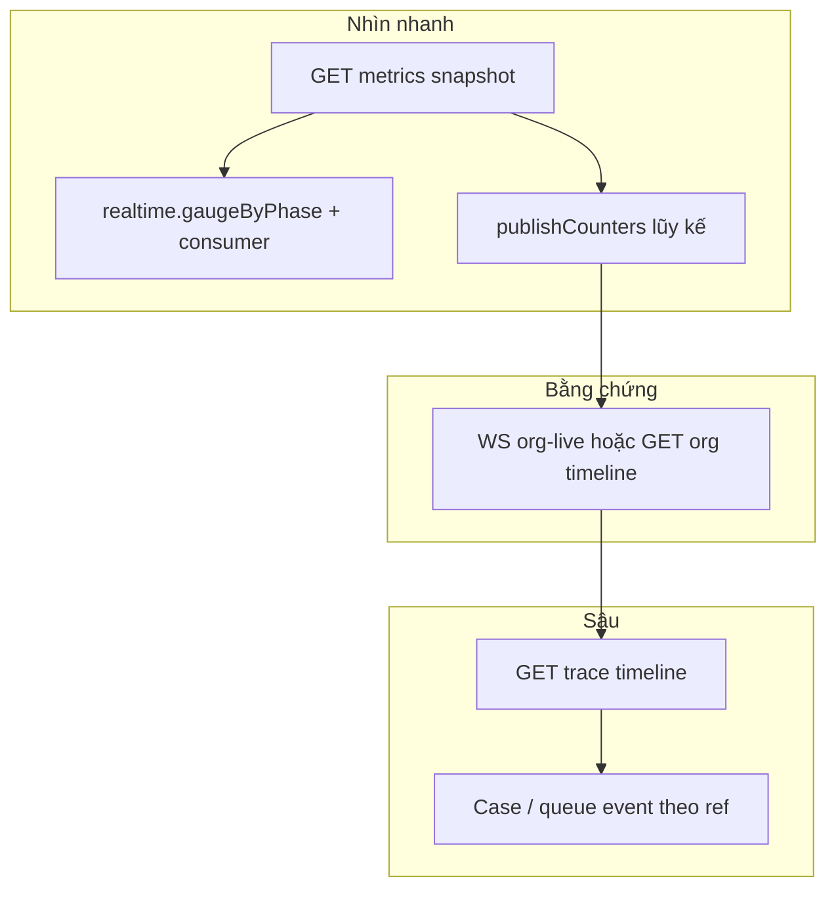

# Trung tâm chỉ huy AI Decision — Ý tưởng màn hình & thiết kế dữ liệu backend

**Phiên bản:** 1.11  
**Ngày:** 2026-04-07  
**Trạng thái:** `GET /ai-decision/org-live/metrics` + WS `aggregate` — **`schemaVersion` 2**, nhóm JSON: **`meta`**, **`queue`**, **`intake`**, **`publishCounters`**, **`realtime`**, **`consumer`**, **`workers`** (RAM per process). **`AI_DECISION_LIVE_ENABLED=0`:** vẫn metrics phễu + gauge (không ring/WS). Chi tiết §5.2. **Phân loại vận hành `opsTier` trên feed live:** §4.4. **Luồng `Publish` từng bước:** §4.5. **Luồng đọc timeline trace / org:** §4.6. **Ghi Mongo `decision_org_live_events`:** §4.7.

---

## 1. Mục đích

Tài liệu này mô tả:

1. **Ý tưởng UX** cho một màn hình vận hành kiểu *command center*: nhìn nhanh biết AI Decision **đang hoạt động thế nào**, **nghẽn ở đâu**, **có sự cố không**.
2. **Thiết kế backend** trả về dữ liệu: phân tầng *tín hiệu mỏng* vs *chi tiết dày*, endpoint / WebSocket đề xuất, schema JSON gợi ý, và **căn chỉnh** với [Unified Data Contract](../../docs-shared/architecture/data-contract/unified-data-contract.md).

**Phạm vi:** Module AI Decision trong `folkgroup-backend` (`api/internal/api/aidecision/`), đặc biệt `decisionlive` và queue `decision_events_queue`. Không mô tả UI cụ thể (Figma); chỉ **khối thông tin** và **hợp đồng dữ liệu**.

---

## 2. Bối cảnh hiện trạng (đã có trong code)

| Nội dung | Vị trí / hành vi |
|----------|------------------|
| Envelope sự kiện live | `DecisionLiveEvent` — `api/internal/api/aidecision/decisionlive/types.go` |
| Publish + fan-out WS | `decisionlive.Publish` — `decisionlive/publish.go` (live bật: ring + WS; live tắt: chỉ metrics trung tâm chỉ huy). **Thứ tự xử lý chi tiết:** §4.5 |
| Snapshot metrics — lũy kế `publishCounters.*` + gauge `realtime.gaugeByPhase` | `command_center_metrics.go` — `BuildCommandCenterSnapshot`, `RecordCommandCenterPublish`, `RecordConsumerWorkBegin` |
| **Gauge** trong `realtime.gaugeByPhase` | `command_center_gauges.go` — chuyển phase theo `Publish` (trace); `worker_held` + `consuming` (event không trace); `adjustGaugeOnLivePublish` |
| Thống kê consumer (lần chạy, avg ms, throughput cửa sổ) | `command_center_consumer_stats.go` — `RecordConsumerCompletion` (sau mỗi lease→xong trong worker) |
| Độ sâu queue | `reconcile_queue_depth.go` + `StartCommandCenterReconciler` trong `main` |
| Replay theo trace | `GET /api/v1/ai-decision/traces/:traceId/timeline` — `decisionlive.Timeline` + backfill; chi tiết §4.6 |
| WebSocket theo trace | `GET /api/v1/ai-decision/traces/:traceId/live` — Subscribe → replay → drain Seq → stream; §4.6 |
| Replay + WS theo org | `GET /api/v1/ai-decision/org-live/timeline`, `GET /api/v1/ai-decision/org-live` (WebSocket) + **aggregate** định kỳ (`AI_DECISION_WS_AGGREGATE_SEC`, mặc định ~3s) |
| Metrics HTTP | `GET /api/v1/ai-decision/org-live/metrics` |
| Tắt publish live | `AI_DECISION_LIVE_ENABLED=0` — **không** ring / WS / persist async; **vẫn** `publishCounters` + **gauge** qua nhánh metrics của `Publish` |
| Log mỗi lần đếm metrics | `AI_DECISION_METRICS_CHANGE_LOG` — đặt `1` để bật (mặc định tắt) |
| Phân loại “đáng xem” cho vận hành | `eventopstier.ClassifyEventType` — `api/internal/api/aidecision/eventopstier/`; điền vào `DecisionLiveEvent` trong `decisionlive.Publish` (§4.4) |
| Ghi persist org-live (Mongo) | Collection **`decision_org_live_events`** — `persistOrgLiveEventAsync` + `BuildOrgLivePersistDocument` (`persist_org.go`, `persist_org_audit.go`); **mục 4.7** |

**Lưu ý lưu trữ:** Lũy kế + gauge chỉ **RAM process** (không Redis). `queue.depth` sau reconcile giữ trong RAM; GET/WS aggregate mặc định **không** đọc Mongo mỗi request. Replay org-live có thể đọc Mongo **`decision_org_live_events`** khi persist bật (**§4.7**); tắt persist → chỉ ring RAM process. **Ghi** vào collection đó chỉ xảy ra khi **live bật** (nhánh Publish có bước 6–7) **và** persist bật.

Tham chiếu API tổng quan: [docs/api/api-overview.md](../api/api-overview.md). Vision AI Decision: [docs-shared/architecture/vision/08 - ai-decision.md](../../docs-shared/architecture/vision/08%20-%20ai-decision.md).

---

## 3. Ý tưởng màn hình (Command center)

### 3.1. Câu hỏi vận hành cần trả lời

| Câu hỏi | Gợi ý nguồn dữ liệu |
|---------|---------------------|
| Hệ có đang xử lý không? Có bị “câm” không? | KPI + heartbeat + (sau này) health worker |
| Bao nhiêu đang chờ / đang chạy / xong / lỗi? | **Metrics snapshot** (§5) + tùy chọn độ sâu queue từ DB |
| Đang kẹt ở bước nào của pipeline? | **`realtime.gaugeByPhase`** (hiện tại); `publishCounters.byPhase` là **lũy kế** — không thay gauge |
| Có bất thường (backlog tăng, lỗi liên tiếp)? | So sánh snapshot theo thời gian + cảnh báo phía UI hoặc rule server |
| Muốn xem một vụ cụ thể? | Feed org-live + click → timeline trace |

### 3.2. Bố cục khối thông tin (logic)

1. **Thanh trạng thái** — Org, môi trường, thời điểm cập nhật (`asOfMs`), cảnh báo nếu live publish tắt.
2. **Hàng KPI** (4–6 ô) — `queue.depth`, `realtime.gaugeByPhase.worker_held`, `consumer.runsLastMinute` / `runsLast5Minutes`, `hasRecentConsumerActivity`, lỗi / backlog.
3. **Phễu “đang có gì trong ống”** — Vẽ từ **`realtime.gaugeByPhase`**: `queued` → `consuming` → `parse` → `llm` → …; phase terminal **không giữ** trên gauge. Khóa **`worker_held`**: event sau lease, chưa hoàn tất.
4. **Lũy kế lifetime (tùy chọn)** — `publishCounters.byPhase`: mỗi `Publish` + consumer không trace; **không** nhầm với gauge.
5. **Phân bổ nguồn (live)** — `bySourceKind` (lũy kế từ `Publish` + bump khi hoàn tất event không trace).
6. **Theo loại queue** — `consumer.byEventType` (key = `event_type` thật trên `decision_events_queue`).
7. **Feed live** — Danh sách sự kiện gần đây (org-live); mỗi dòng có `traceId` khi có; **`opsTier` / `opsTierLabelVi`** để lọc / sắp theo mức ưu tiên vận hành (§4.4).
8. **Drill-down** — Timeline một trace (`timeline` + WS trace); chi tiết nặng qua API riêng.

### 3.3. Sơ đồ luồng dữ liệu (màn hình)



---

## 4. Nguyên tắc thiết kế dữ liệu backend

### 4.1. Hai tầng

| Tầng | Mục đích | Đặc điểm |
|------|-----------|----------|
| **Tín hiệu mỏng (thin)** | KPI, phễu, feed ngắn | JSON nhỏ, có `schemaVersion`, có `asOfMs` |
| **Chi tiết dày (thick)** | CIX đầy đủ, packet quyết định, payload queue | HTTP GET theo id; **không** đổ full blob vào mỗi message WS |

### 4.2. Hợp đồng định danh

Tuân [Unified Data Contract](../../docs-shared/architecture/data-contract/unified-data-contract.md):

- Dùng **canonical** công khai: `trace_id`, `correlation_id`, `decision_id`, `event_id`, `session_uid`, `customer_uid`, …
- **Không** đưa `_id` Mongo ra stream công khai trừ khi đã quy ước là internal-only và tách kênh.

### 4.3. `DecisionLiveEvent` (đã có) — vai trò trong command center

Dùng cho **feed** và **timeline**. **Phễu “đang chạy”** lấy từ **`realtime.gaugeByPhase`** (và `queue.depth`), không chỉ từ feed.

Các field chính (tham chiếu code): `schemaVersion`, `stream`, `seq`, `feedSeq`, `tsMs`, `phase`, `severity`, `traceId`, `correlationId`, `orgId`, `sourceKind`, `sourceTitle`, **`opsTier`**, **`opsTierLabelVi`**, `summary`, `reasoningSummary`, `decisionMode`, `confidence`, `refs`, `step`, `detail`.

**Hướng mở rộng tương thích (đề xuất sau):** thêm `layer` (`intake` | `context` | `core` | `outcome`) và `entityRefs` map join key — không bắt buộc cho bản v1 metrics.

### 4.4. Phân loại vận hành (`opsTier`) — backend là nguồn sự thật

Mục đích: người **quản lý / vận hành** lọc feed org-live và timeline theo mức “đáng xem” trước — tách **quyết định thật**, **chuẩn bị luồng vào quyết định**, và **việc nền / đồng bộ**.

| Field JSON | Ý nghĩa |
|------------|---------|
| `opsTier` | `decision` — thực thi / đề xuất quyết định trực tiếp (vd. `aidecision.execute_requested`, `executor.propose_requested`). `pipeline` — chuẩn bị ngữ cảnh, dẫn vào quyết định (vd. CIX, `order.inserted`, `conversation.*.updated`). `operational` — vận hành / batch / metrics (vd. `crm.intelligence.compute_requested`, `meta_campaign.*`, hầu hết `*.inserted`/`*.updated` không thuộc nhóm pipeline). `unknown` — thiếu `eventType` để suy luận. |
| `opsTierLabelVi` | Nhãn hiển thị tiếng Việt tương ứng (Quyết định / Chuẩn bị quyết định / Vận hành / Chưa phân loại). |

**Code:** `api/internal/api/aidecision/eventopstier/classify.go` — hàm `ClassifyEventType(eventType string) (tier, labelVi string)`. Map tường minh theo `eventType` (vd. `cix.analysis_requested`, `cix_intel_recomputed`, `order_intel_recomputed`); pattern datachanged `<prefix>.inserted` / `<prefix>.updated` với `prefix ∈ { conversation, message, order, cix_analysis_result, … }` → `pipeline`, còn lại → `operational`. **Lưu ý (2026-03-31):** không còn đăng ký consumer cho `cix_analysis_result.inserted|updated` hay `conversation.intelligence_requested` — fan-in CIX qua **`cix_intel_recomputed`** + `analysisResultId`.

**Gắn vào envelope:** `decisionlive.Publish` gọi `enrichLiveEventOpsTier` (`decisionlive/ops_tier_enrich.go`) sau khi chuẩn hóa `severity`:

1. Nếu `refs.eventType` (hoặc `refs.event_type`) có giá trị → phân loại theo chuỗi đó.
2. Nếu `sourceKind === "queue"` và `sourceTitle` khác rỗng (consumer queue live) → coi `sourceTitle` là `eventType`.
3. Nếu không có `eventType` nhưng `phase` thuộc pipeline Execute (vd. `queued`, `consuming`, `parse`, `llm`, `decision`, …) → `opsTier = decision`.
4. Các trường hợp còn lại → `unknown`.

**API ingest:** `POST /api/v1/ai-decision/events` — response `data` thêm `opsTier`, `opsTierLabelVi` (cùng logic `ClassifyEventType` với body `eventType`).

**Ghi chú:** Bản ghi replay đã lưu Mongo (khi bật persist) trước phiên bản có field này có thể thiếu `opsTier` cho đến khi có sự kiện mới.

### 4.5. Luồng `decisionlive.Publish` — xử lý dữ liệu theo từng bước

Mục này mô tả **một lần gọi** `Publish(ownerOrgID, traceID, ev)` từ đầu vào đến đích (ring, WebSocket, metrics, tùy chọn persist). Code: `api/internal/api/aidecision/decisionlive/publish.go`; cập nhật bộ đếm/gauge: `command_center_metrics.go` (`recordCommandCenterPublish`).

**Bước 0 — Kiểm tra đầu vào (bắt buộc có org + trace)**  
- Nếu `traceID` rỗng **hoặc** `ownerOrgID` zero: **dừng ngay**, không ghi ring, không broadcast, không cộng metrics (trừ log cảnh báo khi bật `AI_DECISION_METRICS_CHANGE_LOG=1`).  
- Lý do: mọi tín hiệu phễu theo trace và fan-out WS đều gắn cặp (org, trace).

**Bước 1 — Chuẩn hóa envelope `DecisionLiveEvent`**  
- `schemaVersion`: nếu 0 → gán `1`.  
- `stream`: nếu rỗng → `aidecision.live`.  
- Gán `traceId`, `orgIdHex` từ tham số.  
- `tsMs`: nếu 0 → thời điểm hiện tại (ms).  
- `severity`: nếu rỗng → mức info (hằng số trong package).

**Bước 2 — Làm giàu metadata (phục vụ feed + metrics)**  
- **W3C trace context** (`enrichW3CTraceContext`) — gắn ngữ cảnh trace cho client/debug.  
- **`opsTier` / `opsTierLabelVi`** (`enrichLiveEventOpsTier`) — quy tắc §4.4.  
- **Nguồn feed** (`enrichLiveEventFeedSource`) — phục vụ phân loại trên feed / counters.

**Bước 3 — Nhánh theo `AI_DECISION_LIVE_ENABLED`**

| Điều kiện | Điều gì xảy ra tiếp theo |
|-----------|---------------------------|
| **`AI_DECISION_LIVE_ENABLED=0`** (hoặc giá trị khác `1`/rỗng) | Chỉ gọi `recordCommandCenterPublish(ownerOrgID, ev, "publish_chi_metrics")`: cộng **`publishCounters`** (phase, sourceKind, feed, ops tier) và cập nhật **`realtime.gaugeByPhase`** qua `adjustGaugeOnLivePublish`. **Không** ghi ring replay, **không** WebSocket, **không** `persistOrgLiveEventAsync`. Một lần log cảnh báo cấp process (sync.Once) nhắc vận hành. |
| **Live bật** (mặc định: biến môi trường trống hoặc `1`) | Tiếp tục bước 4–7. |

**Bước 4 — Ring replay theo trace (RAM process)**  
- `globalStore.append(org, trace, ev)` → bản `final` (có `seq` / thứ tự trong ring, giới hạn `MaxEventsPerTrace`).  
- Dùng cho `GET .../traces/:traceId/timeline` và client WS trace sau khi đã replay buffer cũ.

**Bước 5 — Metrics trung tâm chỉ huy (đường publish đầy đủ / WS)**  
- `RecordCommandCenterPublish(ownerOrgID, final)` → bên trong gọi `recordCommandCenterPublish(..., "publish_ws")` — cùng semantics bước 3 nhưng nhãn đếm khác (`publish_ws` vs `publish_chi_metrics`) để phân biệt nguồn bump trong triển khai hiện tại.

**Bước 6 — Fan-out WebSocket**  
- Broadcast kênh **theo trace:** `orgHex:traceId` — subscriber WS trace nhận `final`.  
- Gắn vào **feed org:** `globalOrgFeed.appendOrg` → `orgEv` (có thể thêm field dẫn xuất cho màn org-live).  
- Broadcast kênh **theo org:** `orgHex:__org_feed__` — subscriber org-live nhận `orgEv`.

**Bước 7 — Persist org-live (tùy chọn)**  
- `persistOrgLiveEventAsync` — chỉ có ý nghĩa khi bật cấu hình persist org-live (xem §2, `AI_DECISION_LIVE_ORG_PERSIST`); mặc định thường **không** ghi Mongo.

**Tóm tắt một dòng:**  
- **Live tắt:** chỉ **Bước 0–2** rồi **metrics** (bước 3 nhánh tắt).  
- **Live bật:** **0–2** → **4** (ring) → **5** (metrics) → **6** (WS) → **7** (persist nếu bật).

**Không nhầm với intake queue:** `intake.*` trong snapshot đếm từ **`EmitEvent`** khi ghi `decision_events_queue` (§5.2); **`Publish`** không tăng `intake` — nó phản ánh **tiến trình / timeline** sau khi pipeline đã có mốc live.

### 4.6. Luồng đọc timeline theo trace và theo org (đối chiếu Publish)

**Một trace (`traceId` + org): nguồn dữ liệu** là ring RAM `traceStore` sau các lần **Publish bước 4** (chỉ khi live bật). Code đọc: `decisionlive.Timeline`, `decisionlive.Subscribe`; HTTP/WS: `handler.aidecision.live.go`.

**GET `/api/v1/ai-decision/traces/:traceId/timeline`**  
1. Kiểm tra org + `traceId`.  
2. `Timeline` → `snapshot` ring → `backfillLiveEventsDerivedFields` (bù `opsTier` / feed nếu bản ghi cũ).  
3. Trả JSON `{ traceId, events }`.

**WS `/api/v1/ai-decision/traces/:traceId/live`**  
1. **Subscribe** kênh `orgHex:traceId` **trước** khi gửi replay (tránh race mất mốc Publish xen kẽ).  
2. **Timeline** — lấy toàn bộ mốc đã có, tính `maxSeq`.  
3. Gửi lần lượt từng `DecisionLiveEvent` (sau `SanitizeDecisionLiveEventJSON`).  
4. **Drain** non-blocking `liveCh`: bỏ mốc có `seq ≤ maxSeq` đã nằm trong replay; gửi các mốc mới còn lại trong buffer.  
5. Vòng **stream**: ping/read client + nhận tiếp từ `liveCh` cho đến đóng kết nối.

**Org-live (mọi trace):** `OrgTimelineForAPI` — nếu persist bật thì ưu tiên đọc Mongo `decision_org_live_events` (đảo thứ tự về tăng dần thời gian), lỗi/rỗng thì fallback ring RAM; sau đó luôn **backfill**. WS `/org-live` tương tự với **FeedSeq** thay cho Seq ở bước drain, rồi thêm message **aggregate** định kỳ.

**Điều kiện vận hành:** `AI_DECISION_LIVE_ENABLED=0` — không có mốc mới trên ring; timeline chỉ còn dữ liệu RAM tồn tại trước đó (tới khi restart). Metrics vẫn nhận Publish nhánh chỉ metrics (§4.5 bước 3a).

### 4.7. Collection `decision_org_live_events` — khi nào ghi, document gồm gì, đọc ra sao

**Điều kiện ghi:**  
1. `AI_DECISION_LIVE_ENABLED` bật (Publish chạy bước 4–7).  
2. `AI_DECISION_LIVE_ORG_PERSIST` (hoặc `AIDecisionLiveOrgPersist` trong config) bật.  
3. Có collection trong registry.  
→ `persistOrgLiveEventAsync` gọi sau **Publish bước 6b** (đã có `orgEv` với `FeedSeq`), **InsertOne** bất đồng bộ, timeout 5s; lỗi ghi không chặn pipeline (client vẫn có RAM/WS).

**Một document = một mốc org-live** (tương ứng một lần fan-out org). `docSchemaVersion` = **2**.

**Cấu trúc nội dung (theo `BuildOrgLivePersistDocument`):**  
- **`payload`**: `[]byte` — JSON nguyên vẹn **`DecisionLiveEvent`** (nguồn sự thật đầy đủ cho replay; API rebuild struct bằng `json.Unmarshal`).  
- **Trường phẳng** (lọc, list, UI nhanh): `_id`, `ownerOrganizationId`, `createdAt` (ms server lúc ghi), `traceId`, `w3cTraceId`, `spanId`, `parentSpanId`, `correlationId`, `decisionCaseId`, `phase`, `severity`, `seq`, `feedSeq`, `stream`, `sourceKind`, `sourceTitle`, `feedSourceCategory`, `feedSourceLabelVi`, `opsTier`, `opsTierLabelVi`, `decisionMode`.  
- **UI suy ra**: `uiTitle`, `uiSummary`, `phaseLabelVi`, `stepKind`, `stepTitle`.  
- **`refs`**: map gộp `ev.Refs` + định danh trace/case (audit/query).  
- **`detailBullets`**, **`detailSections`**: copy từ event (BSON lồng).

**Đọc:**  
- **`OrgTimelineForAPI`**: ưu tiên đọc Mongo (chỉ `payload` decode), đảo thứ tự thời gian tăng, **backfill**; fallback RAM nếu persist tắt / lỗi / rỗng.  
- **`GET .../org-live/persisted-events`**: chỉ Mongo, phân trang + lọc (`traceId`, `decisionCaseId`, khoảng `createdAt`), response events từ **payload**.

**Model index trong code:** `api/internal/api/aidecision/models/model.aidecision.org_live_event.go` (`AIDecisionOrgLiveEvent`) — subset trường cho `CreateIndexes`; document thực tế có thêm trường phẳng do `bson.M` khi InsertOne.

---

## 5. Đề xuất API mới: Metrics snapshot (phễu / KPI)

### 5.1. Endpoint

| Phương thức | Đường dẫn | Mục đích |
|-------------|-----------|----------|
| GET | `/api/v1/ai-decision/org-live/metrics` | Snapshot đếm theo org đang chọn (middleware org như các route `org-live`) — **đã implement** |

**Query:** hiện không có tham số bắt buộc; throughput cửa sổ nằm trong `data.consumer` (`runsLastMinute`, `runsLast5Minutes`).

### 5.2. Response (format chuẩn handler)

Giữ đúng pattern `code`, `message`, `data`, `status`. **`data`** là snapshot `CommandCenterSnapshot` (GET và `payload` của WS `aggregate`).

```json
{
  "code": 200,
  "message": "OK",
  "status": "success",
  "data": {
    "schemaVersion": 2,
    "asOfMs": 1710000000000,
    "meta": {
      "livePublishEnabled": true,
      "redisEnabled": false,
      "metricsStore": "memory",
      "liveFunnelFromPublish": true
    },
    "queue": {
      "depth": {
        "pending": 12,
        "leased": 1,
        "processing": 0,
        "failed_retryable": 0,
        "failed_terminal": 0,
        "deferred": 0,
        "other_active": 0,
        "in_flight": 1
      },
      "reconciledAtMs": 1709999700000,
      "refreshedFromMongoThisRequest": false
    },
    "intake": {
      "byEventType": {
        "datachanged": 300,
        "aidecision.execute_requested": 50
      },
      "byEventSource": {
        "datachanged": 280,
        "aidecision": 70
      }
    },
    "publishCounters": {
      "byPhase": {
        "queued": 120,
        "consuming": 45,
        "parse": 30,
        "llm": 12,
        "decision": 0,
        "policy": 0,
        "propose": 8,
        "done": 200,
        "skipped": 1,
        "empty": 0,
        "error": 2,
        "unknown": 0
      },
      "bySourceKind": {
        "conversation": 40,
        "order": 25,
        "unknown": 3
      }
    },
    "realtime": {
      "gaugeByPhase": {
        "worker_held": 1,
        "queued": 0,
        "consuming": 1,
        "parse": 0,
        "llm": 0,
        "decision": 0,
        "policy": 0,
        "propose": 0,
        "done": 0,
        "skipped": 0,
        "empty": 0,
        "error": 0,
        "unknown": 0
      }
    },
    "consumer": {
      "totalCompleted": 500,
      "totalFailed": 3,
      "lastActivityMs": 1710000000000,
      "runsLastMinute": 12,
      "runsLast5Minutes": 58,
      "byEventType": {
        "datachanged": {
          "completed": 400,
          "failed": 1,
          "totalSuccessMs": 1200000,
          "totalFailMs": 0,
          "avgSuccessMs": 3000,
          "avgFailMs": 0,
          "lastCompletedMs": 1710000000000
        }
      }
    },
    "workers": {
      "backgroundWorkersRegistered": 32,
      "aiDecisionConsumerActive": true,
      "aiDecisionConsumerParallelSlots": 4,
      "aiDecisionConsumerThrottled": false
    },
    "hasRecentConsumerActivity": true,
    "alerts": []
  }
}
```

**Ghi chú semantics (bắt buộc đọc khi làm UI):**

| Nhánh JSON | Ý nghĩa |
|------------|---------|
| `meta` | Cờ môi trường: `livePublishEnabled`, `redisEnabled` (luôn `false`), `metricsStore`, `liveFunnelFromPublish`. |
| `queue.depth` | Độ sâu `decision_events_queue` — Mongo **reconcile** → RAM; GET/WS mặc định chỉ đọc RAM. |
| `queue.reconciledAtMs` | Mốc đồng bộ depth gần nhất (ms). |
| `queue.refreshedFromMongoThisRequest` | `true` nếu snapshot build kèm đọc Mongo ngay request này (hiếm). |
| `intake.*` | **Đổ vào thật:** mỗi `EmitEvent` InsertOne OK — `byEventType` / `byEventSource` (queue doc). |
| `publishCounters.byPhase` | **Lũy kế lifetime (process):** mỗi hook `Publish` + consumer **không** `traceId` (`consuming` lúc bắt đầu, `done`/`error` lúc xong). |
| `publishCounters.bySourceKind` | **Lũy kế** chỉ từ **`Publish`** (`sourceKind` timeline) — **không** là intake queue. |
| `realtime.gaugeByPhase` | **Gauge tức thời:** một trace một phase; terminal không giữ slot; `worker_held` = sau lease, chưa hoàn tất. |
| Event **không trace** | Gauge `consuming` ± qua begin/end consumer; có trace: `worker_held` + chuyển phase qua `Publish`. |
| `consumer` | Mỗi lần xử lý xong trên **process này**: ok/fail, throughput cửa sổ, avg ms theo `event_type`. |
| `workers` | Cấu hình worker **process** trả lời (Registry, slot, throttle, active). |
| `hasRecentConsumerActivity` | `runsLastMinute > 0` **hoặc** `queue.depth.in_flight` **hoặc** `realtime.gaugeByPhase.worker_held > 0`. |

**Multi-instance:** RAM riêng — `intake`, `publishCounters`, `realtime`, `consumer` **theo instance**; `queue.depth` sau reconcile vẫn phản ánh DB (theo org); `workers` theo process trả lời.

**Breaking:** `schemaVersion` 1 (flat) hết hiệu lực; client phải đọc nhánh mới.

### 5.3. Cách triển khai (đã áp dụng trong code)

1. **RAM (per process)**  
   - Đổ vào queue: `EmitEvent` → `RecordCommandCenterIntake` (`command_center_intake.go`).  
   - Lũy kế timeline: `Publish` → `RecordCommandCenterPublish`; consumer không trace → `RecordConsumerWorkBegin` + `RecordConsumerCompletion` (phase, **không** bump `bySourceKind` khi xong).  
   - Gauge: `adjustGaugeOnLivePublish` + `recordConsumerWorkBeginGauge` / `recordConsumerWorkEndGauge` (`command_center_gauges.go`).  
   - Worker: `BuildCommandCenterWorkersSnapshot` (`command_center_workers.go`).

2. **Đồng bộ queue**  
   - `reconcile_queue_depth.go`: đếm Mongo theo org → ghi `memQueueDepth`; ticker `AI_DECISION_METRICS_RECONCILE_SEC` (mặc định 300s); lần đầu đồng bộ khi `StartCommandCenterReconciler` chạy.

3. **Multi-instance**  
   - `queueDepth` (sau reconcile trên từng instance) vẫn đọc cùng Mongo nên **số backlog nhất quán**; gauge / lũy kế / `consumer` **chỉ đại diện instance** đang xử lý request hoặc chạy worker. Mở rộng sau: Redis hoặc aggregate tập trung nếu cần một màn hình tổng cluster.

---

## 6. Đề xuất tùy chọn: WebSocket aggregate

Để màn hình **không poll** liên tục:

- Trên kênh `org-live` hiện tại, **hoặc** kênh WS riêng `GET /api/v1/ai-decision/org-live/metrics-stream`:
  - Gửi định kỳ (vd. mỗi 2–5 giây) một message JSON: `{ "type": "aggregate", "payload": { ... cùng cấu trúc con của §5.2 } }`.
- Message chi tiết `DecisionLiveEvent` **giữ nguyên** — client phân biệt bằng `type` hoặc nhận diện `schemaVersion` + có/không field `phase` ở root.

Dùng **`schemaVersion`** trong `data` (hiện **2**) để client tách phiên bản parser.

---

## 7. Ma trận nguồn dữ liệu → khối UI

| Khối UI | Nguồn đề xuất | Hiện có? |
|---------|----------------|----------|
| Feed live | WS `org-live` hoặc GET `org-live/timeline` | Có |
| Timeline một trace | GET `traces/:traceId/timeline` / WS trace | Có |
| Phễu / KPI / queue | GET `org-live/metrics` hoặc WS `aggregate`: `realtime`, `publishCounters`, `consumer`, `queue` | **Có** |
| Cảnh báo live tắt | `meta.livePublishEnabled` + `alerts` | Có |
| Chi tiết case / payload | API case + queue theo `refs` / `entityRefs` (sau mở rộng) | Một phần qua module hiện có |

---

## 8. Lộ trình triển khai gợi ý

| Giai đoạn | Việc làm |
|-----------|----------|
| **V1** | `GET org-live/metrics`, WS `aggregate`, `byPhase`/`bySourceKind` lũy kế, `queueDepth` reconcile Mongo → RAM. |
| **V1.4** | `gaugeByPhase` (gauge thật + `worker_held`), `consumer` (runs / avg theo `event_type`), `hasRecentConsumerActivity` mở rộng, tách rõ lũy kế vs gauge trong tài liệu. |
| **V2** | Chuẩn hóa `Publish` để mọi milestone có `sourceKind` / `entityRefs` đầy đủ; publish thêm tại intake/routing/lỗi nếu thiếu. |
| **V3** | Đồng bộ metrics cluster (Redis hoặc service aggregate); alert rule trên server. |

---

## 9. Tài liệu liên quan

- [16-ai-decision-ops-tier.md](../../docs-shared/architecture/vision/16-ai-decision-ops-tier.md) — hợp đồng `opsTier` / `opsTierLabelVi` (**docs-shared**, dùng chung back/front)
- [api-context-ai-decision-ops-tier.md](../../docs-shared/ai-context/folkform/api-context-ai-decision-ops-tier.md) — bổ sung API ingest + live (đề xuất 4.09, **docs-shared**)
- [api-overview.md](../api/api-overview.md) — AI Decision routes (backend)
- [08 - ai-decision.md](../../docs-shared/architecture/vision/08%20-%20ai-decision.md) — Vision (**docs-shared**)
- [unified-data-contract.md](../../docs-shared/architecture/data-contract/unified-data-contract.md) — Định danh & event base
- Code: `api/internal/api/aidecision/decisionlive/` (`command_center_metrics.go`, `command_center_gauges.go`, `command_center_consumer_stats.go`, `reconcile_queue_depth.go`, `publish.go`, `persist_org.go`, `persist_org_audit.go`, `ops_tier_enrich.go`), `models/model.aidecision.org_live_event.go`, `eventopstier/classify.go`, `queuedepth/sync.go` (độ sâu queue RAM), `handler/handler.aidecision.live.go`, `router/routes.go`, worker `worker.aidecision.consumer.go`
- **Đối chiếu MongoDB:** `go run ./cmd/aidecision_queue_metrics_audit` (toàn DB) hoặc `go run ./cmd/aidecision_queue_metrics_audit <ownerOrganizationId hex>` — cùng pipeline reconcile `queueDepth`, thêm đếm mọi `status` và bản ghi thiếu `ownerOrganizationId`.
- **WebSocket trình duyệt (Chrome / Flutter Web):** `AuthMiddleware` + org context hỗ trợ fallback query `access_token` (hoặc `token`) và `role_id` khi không gửi được `Authorization` / `X-Active-Role-ID` trên handshake — cùng luồng kiểm tra như REST.

---

## 10. Lịch sử thay đổi

| Ngày | Phiên bản | Nội dung |
|------|-----------|----------|
| 2026-03-25 | 1.0 | Khởi tạo: ý tưởng command center + thiết kế metrics API / WS aggregate + ma trận nguồn dữ liệu |
| 2026-03-25 | 1.1 | Triển khai code: `command_center_metrics.go`, `reconcile_queue_depth.go`, route metrics, WS aggregate, `StartCommandCenterReconciler` trong `main` |
| 2026-03-25 | 1.2 | CLI `cmd/aidecision_queue_metrics_audit` đối chiếu Mongo ↔ `queueDepth` |
| 2026-03-25 | 1.3 | Middleware: query `access_token`/`token`, `role_id` fallback cho WS trình duyệt |
| 2026-03-25 | 1.4 | Metrics RAM: `gaugeByPhase` (gauge + `worker_held`), `consumer`, cập nhật mục 2–3–5–8; bỏ mô tả Redis cho phễu; JSON mẫu §5.2 khớp `CommandCenterSnapshot` |
| 2026-03-25 | 1.5 | `intakeByEventType` / `intakeByEventSource` (sau `EmitEvent`); `workers`; `bySourceKind` chỉ từ Publish; consumer xong không bump `bySourceKind` |
| 2026-03-25 | 1.6 | `AI_DECISION_LIVE_ENABLED=0`: vẫn cập nhật phễu + gauge phase qua `Publish` (không ring/WS); alert `live_disabled` và env mô tả trong api-overview khớp hành vi |
| 2026-03-25 | 1.7 | **schemaVersion 2:** nhóm `meta` / `queue` / `intake` / `publishCounters` / `realtime` / `consumer` / `workers` — tách semantics, bỏ flat root |
| 2026-03-25 | 1.8 | **`opsTier` / `opsTierLabelVi`** trên `DecisionLiveEvent` + `eventopstier`; `POST /ai-decision/events` trả tier; persist org-live `decision_org_live_events` + env `AI_DECISION_LIVE_ORG_PERSIST` (mặc định tắt); refresh `queue.depth` sau emit/lease/complete (package `queuedepth`) — §4.4, §2 |
| 2026-04-07 | 1.9 | **§4.5** — mô tả luồng `decisionlive.Publish` theo từng bước (đầu vào → chuẩn hóa → enrich → nhánh live tắt/bật → ring → metrics → WS → persist); làm rõ khác `intake` |
| 2026-04-07 | 1.10 | **§4.6** — luồng đọc timeline trace (GET/WS) và org-live (`OrgTimelineForAPI`, FeedSeq, drain); đồng bộ comment code `types`, `publish`, `store`, handler live |
| 2026-04-07 | 1.11 | **§4.7** — `decision_org_live_events`: điều kiện ghi, cấu trúc document (payload JSON + trường phẳng), cách đọc; comment model, persist, handler persisted-events |
