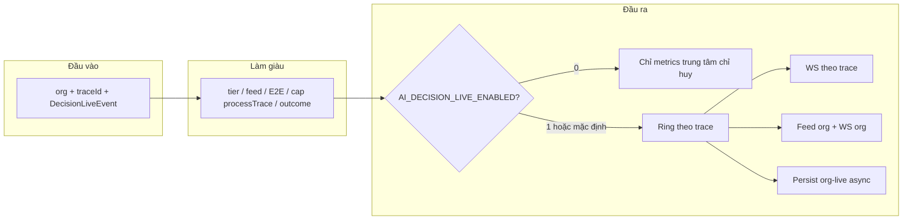

# Bảng giai đoạn — bước — sự kiện (đầu-cuối: CIO → Domain → AID → Executor → Learning)

**Toàn bộ tài liệu sắp theo khung sáu trường** (cùng «ngôn ngữ» với **một bước** trên timeline — xem mục 4.1): `label` · `purpose` · `inputSummary` · `logicSummary` · `resultSummary` · `nextStepHint`.

| Trường              | Phần trong file                                                                                                        | Nội dung chính                                                                                                          |
| ------------------- | ---------------------------------------------------------------------------------------------------------------------- | ----------------------------------------------------------------------------------------------------------------------- |
| `**label`**         | [§1](#1-label--tên-và-quy-ước)                                                                                         | **Trục vụ** (pha/bước theo dõi vụ); quy ước G1–G6 / `Gx-Syy`; **§1.1–1.2** từ vựng miền & mã lưu đồ.                    |
| `**purpose`**       | [§2](#2-purpose--vì-sao-có-luồng-này)                                                                                  | Vì sao cần trace/audit; ràng buộc emit/publish; hai lớp envelope vs consumer.                                           |
| `**inputSummary**`  | [§3](#3-inputsummary--đầu-vào-và-tham-chiếu-code) (kèm [§3.1](#31-api-catalog-e2e-json-cho-frontend) API catalog JSON) | Collection, file code, hàm resolve, link hợp đồng — **đầu vào** để đọc luồng; GET `e2e-reference-catalog` cho frontend. |
| `**logicSummary`**  | [§4](#4-logicsummary--cách-hệ-thống-chạy)                                                                              | Khung sáu trường **từng bước**, Publish, `processTrace` consumer, Phương án B, khung mốc + liên kết.                    |
| `**resultSummary`** | [§5](#5-resultsummary--đầu-ra-và-tra-cứu)                                                                              | **Sáu pha chính** + neo G1–G6; [gom bước](#gom-buoc-truc-vu) §5.2; `outcome*`; §5.3; mức độ khớp code.                  |
| `**nextStepHint`**  | [§6](#6-nextstephint--đọc-tiếp-và-vận-hành)                                                                            | Mapping P01–P13, ghi chú vận hành, changelog.                                                                           |

---

## 1. `label` — Tên và quy ước

`**label` (cấp tài liệu):** Bảng tra **giai đoạn — bước — sự kiện** end-to-end; tên kỹ thuật giữ nguyên theo code.

**Nguyên tắc ngôn ngữ:** Mô tả tiếng Việt; giữ nguyên `eventType`, `eventSource`, `pipelineStage`, tên hàm, collection, endpoint.

**Cách chia pha:** Trên **trục vụ** đọc **sáu pha chính** — pha ghi thô, pha merge, pha intel, pha ra quyết định, pha thực thi, pha học ([§5.2](#52-bảng-giai-đoạn-lớn-đọc-trước)). **Pha ghi thô (G1)** trên máy chỉ **CIO ingress → L1 → `EmitDataChanged` → enqueue** (`G1-S01`…`G1-S04`; xem `E2EStageCatalog`). **Consumer một cửa** trên `decision_events_queue` và **merge L1→L2** được gom vào **pha merge (G2)** — timeline consumer neo **G2-S01…S03**, worker merge neo **G2-S04…S06** (§5.3). Trong **code / resolver / API** có **sáu** giai đoạn **G1–G6** (`e2eStage`, bảng §5.3, trường `stages` của `e2e-reference-catalog`); trong đó có **bước (S)** và **sự kiện (E)**. Pha nhỏ cũ P01–P13 gom ở [§6](#6-nextstephint--đọc-tiếp-và-vận-hành).

**Quy ước ID:** `Gx-Syy`; chi tiết `Gx-Syy-Ezz` khi cần.

### Trục vụ — mục đích của pha và bước

**Pha (sáu pha chính; neo G1–G6) và bước (`Gx-Syy`) là trục vụ:** dùng để **theo dõi một vụ** theo hành trình nghiệp vụ đầu–cuối — từ lúc dữ liệu vào hệ thống (CIO / kênh ingress), qua ghi miền và event, điều phối AID, intel miền, case và quyết định, thực thi, tới outcome, `**learning_cases`** và vòng feedback. Catalog E2E, `e2eStage` / `e2eStepId` trên timeline và bảng §5 phục vụ **câu hỏi «vụ này đang ở đoạn nào của quy trình?»**, không phải danh sách mọi hàng đợi vật lý.

**Tách khỏi trục triển khai (nhiều queue / worker):** runtime có **nhiều** collection job và worker ở module khác nhau (ví dụ `decision_events_queue`, debounce, merge pending, `*_intel_compute`, …). Một **pha trục vụ** có thể tương ứng **chuỗi job** qua vài queue; **không** quy định mỗi queue là một dòng `Gx-Syy` trong bảng. Việc đi qua queue nào, worker nào — mô tả ở **Publish** (`refs`, `businessDomain`), cây `**processTrace`**, `**TraceStep**` (`inputRef` / `outputRef`), và tài liệu vận hành.

**Sự kiện (`eventType`, envelope):** là **cầu nối** giữa trục vụ và máy (map trong `e2e_reference.go`); bảng chi tiết §5.3 vẫn liệt kê đủ để tra code, nhưng **đọc cho người** ưu tiên theo **vị trí trên trục vụ** (Gx / nhãn bước), rồi mới drill-down kỹ thuật. **Gom bước theo trục vụ:** [§5.2 — sáu pha chính + đoạn gom](#gom-buoc-truc-vu).

### 1.1. Lớp kiến trúc (swimlane) — mã cho lưu đồ dòng chảy

**Mục đích:** Một **hàng ngang** (swimlane) trên lưu đồ = một lớp trách nhiệm; **không** trộn với tên module Go hay `eventSource`. Cột **«Nhóm trách nhiệm»** ở [§5.3](#bang-catalog-chi-tiet-e2e) khớp cột **«Nhóm trách nhiệm (cột §5.3)»** trong bảng dưới; cột **«Tên đầy đủ (VN)»** dùng làm nhãn swimlane cho người đọc (song song với mã `ING`…`FBK`).

| Mã lưu đồ | Tên đầy đủ (VN)                                             | Nhóm trách nhiệm (cột §5.3)                  | Giai đoạn Gx điển hình                            |
| --------- | ----------------------------------------------------------- | -------------------------------------------- | ------------------------------------------------- |
| `**ING`** | Tiếp nhận / kênh vào (Ingress)                              | `CIO` (catalog G1; tương đương swimlane ING) | Pha ghi thô — G1 (webhook, sync kênh)             |
| `**DOM**` | Miền dữ liệu (hợp nhất L2)                                  | `DomainData`                                 | Pha merge — G2 (L1→L2)                            |
| `**AID**` | AI Decision (bus `decision_events_queue`, consumer một cửa) | `AID`                                        | Pha merge (consumer) + pha ra quyết định — G2, G4 |
| `**INT**` | Intel miền (job `*_intel_compute`, handoff `*_recomputed`)  | `DomainIntel`                                | Pha intel — G3                                    |
| `**EXC**` | Thực thi (Executor)                                         | `Executor`                                   | Pha thực thi — G5                                 |
| `**OUT**` | Kết quả giao / phản hồi kênh (outcome kỹ thuật)             | `Outcome`                                    | Pha học — G6 (đoạn đầu)                           |
| `**LRN**` | Học tập (learning cases, đánh giá)                          | `Learning`                                   | Pha học — G6                                      |
| `**FBK**` | Phản hồi cải tiến (gợi ý rule/policy)                       | `Feedback`                                   | Pha học — G6 (đoạn cuối)                          |

**Tiêu đề file** (*CIO → Domain → AID → Executor → Learning*) đọc theo swimlane: `**ING`/`DOM` → `AID` → `EXC` → `LRN`** (có thể lồng `**INT**` giữa `DOM` và `AID`, `**OUT`/`FBK**` sau `EXC`).

### 1.2. Miền nghiệp vụ (bounded context) — tên gọi thống nhất

**Mục đích:** Trong **subgraph** bên trong swimlane `DOM` / `INT`, dùng **một** bộ tên dưới đây (cột «Tên trên lưu đồ»); tránh xen kẽ «CRM / crm / khách», «Ads / Meta / quảng cáo» không có quy ước.

| Mã miền            | Tên trên lưu đồ (VN)                    | Package Go (tham chiếu)           | Ghi chú ngắn                                                                                          |
| ------------------ | --------------------------------------- | --------------------------------- | ----------------------------------------------------------------------------------------------------- |
| `**cio`**          | CIO (điều phối đa kênh)                 | `cio/`                            | Ingress có kiểm soát; không thay cho toàn bộ `ING`.                                                   |
| `**pc**`           | Pancake (PC)                            | `pc/`                             | Ingress POS/Pages → L1.                                                                               |
| `**fb**`           | Facebook                                | `fb/`                             | Ingress Page/hội thoại → L1.                                                                          |
| `**webhook**`      | Webhook                                 | `webhook/`                        | HTTP ngoài → thường chuyển tiếp sync.                                                                 |
| `**meta**`         | Meta Ads (thực thể & insight L1)        | `meta/`                           | Tiền đề pipeline quảng cáo; job intel Meta.                                                           |
| `**ads**`          | Ads (API/rule phía Ads)                 | `ads/`                            | Phối hợp với `meta` trên luồng intel/đề xuất.                                                         |
| `**crm**`          | CRM (khách, merge, intel CRM)           | `crm/`                            | L2 canonical, `crm_pending_merge`, `crm_intel_*`.                                                     |
| `**order**`        | Đơn hàng (commerce)                     | `order/`, `orderintel/`           | Đồng bộ đơn + `order_intel_*`.                                                                        |
| `**conversation**` | Hội thoại (mirror messaging)            | `conversation/`, `fb/` (tin nhắn) | Sự kiện `conversation.*` / `message.*` trên bus.                                                      |
| `**cix**`          | CIX (intel hội thoại theo pipeline CIX) | `cix/`, `conversationintel/`      | `cix.analysis_requested`, `cix_intel_*`; **không** gọi chung là «AI Decision» khi ý chỉ pipeline CIX. |
| `**report`**       | Báo cáo                                 | `report/`                         | Dirty/snapshot; side-effect sau datachanged.                                                          |
| `**notification**` | Thông báo                               | `notification/`                   | Kênh/template — ngoài trục E2E chính nếu không vẽ.                                                    |

**Quy tắc vẽ:**

1. **Swimlane** chỉ dùng mã `**ING` … `FBK`** (§1.1).
2. **Ô / subgraph miền** dùng **«Tên trên lưu đồ (VN)»** + khi cần chú thích nhỏ mã `**crm`**, `**cix**`, … trong ngoặc (để khớp repo).
3. `**eventSource**` trên envelope (vd. `crm_intel`, `order_intel`, `meta_ads_intel`) là **nhãn máy** — giữ nguyên trong bảng §5.3; trên lưu đồ người đọc ưu tiên **tên miền §1.2**, kèm chú thích `eventSource` nếu cần audit.

**Timeline / API (`DecisionLiveEvent`):** field `**businessDomain`** (JSON) — **module đang xử lý mốc** (queue/worker phát `Publish`), không đồng nhất với «chủ nghiệp vụ của payload» trên envelope: milestone consumer `**decision_events_queue`** (pha `queue_processing` / `queue_done` / `queue_error` / `datachanged_effects`, …) → `**aidecision**` dù `eventType` là `crm_*` hay `pos_*`; milestone worker intel miền (`intel_domain_*` + `refs.intelDomain`) → `**crm` | `order` | `cix` | `ads**`; pipeline execute/orchestrate/engine trong AID → `**aidecision**`. Mã vẫn nằm trong cùng bảng «Mã miền» §1.2 (`crm`, `order`, `meta`, `pc`, `cix`, `aidecision`, `unknown`, …) để lọc UI. Kèm `**businessDomainLabelVi**` (nhãn tiếng Việt + mã trong ngoặc, vd. «AI Decision (aidecision)») — **UI cột swimlane «module xử lý» phải dùng hai field này**, không dùng `**feedSourceLabelVi`** (chip «Nguồn»; giá trị «Khác» chỉ nghĩa nhóm nguồn dữ liệu chưa xếp loại, không phải tên module). Emitter ghi đè hợp lệ qua `**refs.businessDomain**`. Persist org-live: cột phẳng `**businessDomain**`, `**businessDomainLabelVi**`, `refs`. Logic: `api/internal/api/aidecision/decisionlive/business_domain_enrich.go`. **Lưu đồ nghiệp vụ theo chủ đề payload** → dùng khái niệm `**ownerDomain`** ở [§1.3](#13-owner-domain-của-event-để-vẽ-lưu-đồ-nghiệp-vụ), tách với `businessDomain`.

**Đọc thêm (ngữ cảnh kiến trúc):** `eventtypes/names.go`, `pipeline_stage.go`, `**e2e_reference.go`**. Hợp đồng: [unified-data-contract 2.5e](../../docs-shared/architecture/data-contract/unified-data-contract.md#contract-25e-e2e-reference); [api-context 4.14](../../docs-shared/ai-context/folkform/api-context.md#version-414). Khung ingress: `docs/05-development/KHUNG_LUONG_INGEST_MERGE_INTEL_CIO_AID_DOMAIN.md`. Nhóm module B–D: [co-cau-module-aid-va-domain-queue.md](../module-map/co-cau-module-aid-va-domain-queue.md).

### 1.3. Owner domain của event (để vẽ lưu đồ nghiệp vụ)

**Mục đích:** Khi theo dõi một event trên `decision_events_queue`, cần phân biệt:

- `**ownerDomain` (miền nghiệp vụ sở hữu ý nghĩa event)**: dùng để vẽ lưu đồ nghiệp vụ.
- `**consumerDomain` (miền thực thi bước điều phối)**: thường là `aidecision` ở **mốc consumer** queue (neo **G2** — `G2-S01`…`S03`), không phải owner business.

**Quy tắc chốt để vẽ lưu đồ:**

1. **Vẽ theo `ownerDomain`**, không vẽ theo tên worker tiêu thụ trước mắt.
2. Nếu mốc là lifecycle của queue consumer (`QueueMilestone*`) thì giữ owner theo `**refs.eventType` gốc**, không đổi sang `aidecision`.
3. Với event handoff `*_intel_recomputed`, owner là **miền intel phát ra** (`crm_intel`, `order_intel`, `cix_intel`, `meta_ads_intel`), dù AID là nơi nhận và quyết định tiếp.

| Dấu hiệu event                                          | `ownerDomain`                                                                     | Gợi ý package/module         |
| ------------------------------------------------------- | --------------------------------------------------------------------------------- | ---------------------------- |
| `conversation.*`, `message.*`                           | `conversation`                                                                    | `fb/`, `conversation/`       |
| `order.*`, `commerce.order_*`                           | `order`                                                                           | `order/`, `orderintel/`      |
| `crm.*`, `customer.context_*`, `customer.flag_*`        | `crm`                                                                             | `crm/`                       |
| `cix.*`, `cix_intel_*`                                  | `cix`                                                                             | `cix/`, `conversationintel/` |
| `ads.*`, `campaign_*`, `meta_ad_*`, `meta_ad_insight.*` | `ads` hoặc `meta` (xem nguồn phát)                                                | `ads/`, `meta/`              |
| `*_intel_recomputed`                                    | miền intel phát event (`crm_intel`, `order_intel`, `cix_intel`, `meta_ads_intel`) | worker miền tương ứng        |
| `aidecision.*`, `executor.propose_requested`            | `aidecision`                                                                      | `aidecision/`                |
| `execution.*`                                           | `executor`                                                                        | `executor/`                  |
| `learning.*`                                            | `learning`                                                                        | `learning/`                  |

**Quy tắc ưu tiên khi suy ra `ownerDomain` từ bản ghi queue (theo thứ tự):**

1. `payload.ownerDomain` (nếu đã có và hợp lệ theo bảng trên).
2. Map từ `eventType` theo bảng trên.
3. Nếu mơ hồ, dùng `eventSource` để chốt miền phát (`crm_intel`, `order_intel`, `meta_ads_intel`, ...).
4. Cuối cùng mới fallback `aidecision` (chỉ khi event thực sự thuộc orchestration của AID).

**Áp dụng vào lưu đồ:** Mỗi node event nên có nhãn dạng `**[ownerDomain] eventType`** (ví dụ: `[crm] crm.intelligence.recompute_requested`) để nhìn thấy rõ event đang được tạo bởi miền nào.

---

## 2. `purpose` — Vì sao có luồng này

`**purpose`:** Cho phép **trace** và **audit** thống nhất — cùng một việc nhìn được trên queue, timeline live, Mongo org-live; neo G1–G6 không mơ hồ.

**Ràng buộc vận hành:** Mọi emit `decision_events_queue` gán `e2eStage` / `e2eStepId` / `e2eStepLabelVi` (và `e2e*` trong payload) theo `ResolveE2EForQueueEnvelope`. Mọi `decisionlive.Publish` làm giàu `DecisionLiveEvent` qua `enrichPublishE2ERef` (refs hoặc `phase`); timeline consumer gán **G2-S01…S03** qua `ResolveE2EForQueueConsumerMilestone`. Persist `decision_org_live_events` có cột phẳng `e2e*`, `**businessDomain`**, `**outcomeKind**`, `**outcomeAbnormal**`, `**outcomeLabelVi**`, `**processTrace**`, `payload` đầy đủ.

**Hai lớp đọc trên cùng một job queue:** (1) **Envelope** — nghĩa nghiệp vụ theo `eventType` (G1 enqueue từ L1, G2 merge / intel tiếp theo, G3 intel, G4 quyết định…); (2) **Mốc consumer live** — neo **G2** (pha merge — consumer một cửa) khi worker xử lý job. Một trace có thể có cả mốc **G2** (consumer) và **G4** (engine / case).

---

## 3. `inputSummary` — Đầu vào và tham chiếu code

`**inputSummary`:** **Vào** hệ thống gồm envelope queue, org, `traceId`, miền dữ liệu — tra theo bảng dưới và bảng chi tiết [§5](#5-resultsummary--đầu-ra-và-tra-cứu).

### Bảng tham chiếu E2E trong code (một nguồn)

| Thành phần                           | Vai trò                                                                                                                                                                                                                                                                                                                                                                                |
| ------------------------------------ | -------------------------------------------------------------------------------------------------------------------------------------------------------------------------------------------------------------------------------------------------------------------------------------------------------------------------------------------------------------------------------------- |
| `**eventtypes/e2e_reference.go`**    | Nguồn sự thật máy: `ResolveE2EForQueueEnvelope`, `ResolveE2EForQueueConsumerMilestone`, `ResolveE2EForLivePhase`, `MergePayloadE2E`. Đổi bảng G/S/E ở doc phải cập nhật map tương ứng trong file này.                                                                                                                                                                                  |
| `**decision_events_queue**`          | Trường top-level: `e2eStage`, `e2eStepId`, `e2eStepLabelVi`; payload lặp khóa `e2eStage`, `e2eStepId`, `e2eStepLabelVi` (emit qua `EmitEvent` / `eventemit.EmitDecisionEvent`). Bản ghi cũ trước khi triển khai có thể thiếu các trường này.                                                                                                                                           |
| `**decisionlive.Publish**`           | Sau enrich trace/feed: `enrichPublishE2ERef` — nếu mốc đã có `e2eStepId` (ví dụ timeline consumer) thì **không ghi đè**; nếu chưa có: ưu tiên map từ `refs.eventType` (+ `eventSource`, `pipelineStage` trong refs), không đủ thì map từ `phase`. Sau đó: `CapDecisionLiveProcessTrace`, `**EnrichLiveOutcomeMetadata`** (`outcomeKind` / `outcomeAbnormal` / `outcomeLabelVi`).       |
| **Timeline consumer (queue → live)** | `decisionlive/livecopy/BuildQueueConsumerEvent`: luôn gắn **G2-S01…S03** theo mốc vòng đời worker (nhận job / xong datachanged / đóng handler…), **độc lập** với nghĩa nghiệp vụ của `eventType` (ví dụ job `crm_intel_recomputed` vẫn hiển thị **G2** trên mốc consumer). `**TraceStep`** (Phương án B): `inputRef` / `outputRef` / `reasoning` — xem `livecopy/queue_trace_step.go`. |
| `**decision_org_live_events**`       | `BuildOrgLivePersistDocument` ghi cột phẳng `e2eStage`, `e2eStepId`, `e2eStepLabelVi`, `outcomeKind`, `outcomeAbnormal`, `outcomeLabelVi`, `processTrace` (cùng `payload` JSON đầy đủ). Index Mongo: xem struct `AIDecisionOrgLiveEvent`.                                                                                                                                              |

### 3.1. API catalog E2E (JSON cho frontend)

**Mục đích:** Frontend (lưu đồ swimlane, tooltip, legend, bảng tra cứu) lấy **cùng nội dung** với §5.2–5.3 dưới dạng JSON — không cần hard-code bảng G1–G6 trong app.

**HTTP:** **GET** `/v1/ai-decision/e2e-reference-catalog` — quyền `**MetaAdAccount.Read`** + **org context** (cùng pattern các GET `/ai-decision/*` khác). Handler: `api/internal/api/aidecision/handler/handler.aidecision.e2e_catalog.go`.

**Response** (`status: success`): object `data` gồm:

| Khóa              | Nội dung                                                                                                                                                                                                                                                              |
| ----------------- | --------------------------------------------------------------------------------------------------------------------------------------------------------------------------------------------------------------------------------------------------------------------- |
| `schemaVersion`   | Số nguyên (`eventtypes.E2ECatalogSchemaVersion`) — tăng khi đổi shape hoặc cột; client có thể cache theo version. **v10:** `steps` có `descriptionTechnicalVi` + `descriptionUserVi` (bỏ `shortVi`); `stages` có `userSummaryVi`; `queueMilestones` có `userLabelVi`. |
| `docRef`          | Chuỗi tham chiếu tài liệu (§5.2–5.3 file này).                                                                                                                                                                                                                        |
| `stages`          | Mảng **sáu** giai đoạn G1…G6 — khớp bảng **G1–G6** trong §5.2 (`E2EStageCatalog`): `id`, `swimlaneCode`, `titleVi`, `summaryVi` (kỹ thuật), `**userSummaryVi`** (thân thiện end-user), `ingressHint`.                                                                 |
| `steps`           | Mảng bước chi tiết — khớp **§5.3**: `stageId`, `stepId`, `eventDetailId`, `**descriptionTechnicalVi`**, `**descriptionUserVi**`, `eventType`, `eventSource`, `pipelineStage`, `responsibilityGroup`.                                                                  |
| `queueMilestones` | Mảng mốc consumer (**G2**): `key`, `stageId`, `stepId`, `labelVi` (kỹ thuật), `**userLabelVi`** (thân thiện) — khớp `ResolveE2EForQueueConsumerMilestone`.                                                                                                            |
| `livePhaseMap`    | Mảng map `DecisionLiveEvent.phase` → `e2eStage`, `e2eStepId`, `e2eStepLabelVi` — sinh từ `ResolveE2EForLivePhase` (`decisionlive/e2e_live_phase_catalog.go`).                                                                                                         |

**Nguồn code bảng tĩnh:** `api/internal/api/aidecision/eventtypes/e2e_catalog.go` — **bắt buộc đồng bộ** khi sửa bảng Markdown §5.2–5.3. Khi thêm **phase** timeline mới: thêm hằng trong `decisionlive/types.go`, cập nhật `e2e_reference.go` (`ResolveE2EForLivePhase`) và danh sách phase trong `E2ELivePhaseCatalog()`.

---

## 4. `logicSummary` — Cách hệ thống chạy

`**logicSummary`:** **Kiểm tra / suy luận / thứ tự** — Publish, consumer, cây `processTrace`, Phương án B, liên kết giữa các mốc. **Từng micro-bước** trên cây nên điền theo khung sáu trường dưới đây (gói trong `labelVi` + `detailVi` hoặc mở rộng schema sau).

### 4.1. Khung sáu trường — một bước logic (product, trace, audit)

| Trường                  | Ý nghĩa                                           | Yêu cầu                                                                                  |
| ----------------------- | ------------------------------------------------- | ---------------------------------------------------------------------------------------- |
| **1 — `label`**         | Tên bước ngắn — đọc một lần biết **đang làm gì**. | Tiếng Việt; trùng ý `labelVi` trên nút cây.                                              |
| **2 — `purpose`**       | Bước này **tồn tại để làm gì** trong pipeline.    | Một câu — «vì sao có bước này».                                                          |
| **3 — `inputSummary`**  | **Đầu vào** (ref rút gọn).                        | `eventType`, `sourceCollection`, `entityId`, `orgId`, … — không raw PII / full document. |
| **4 — `logicSummary`**  | Đã **kiểm tra / so sánh / suy luận** gì.          | **Quan trọng nhất** cho audit — «vì sao hệ thống làm vậy».                               |
| **5 — `resultSummary`** | **Kết quả trực tiếp** của bước.                   | Khác `nextStepHint`: output của bước hiện tại.                                           |
| **6 — `nextStepHint`**  | **Sau bước này** đi đâu.                          | Nối chuỗi nhân quả giữa nút cây / mốc timeline.                                          |

**Ví dụ `label`:** Nhận hội thoại mới · Đọc lại dữ liệu vừa thay đổi · Kiểm tra chính sách xử lý · Chọn luồng xử lý · Lên lịch xử lý tiếp theo · Đẩy job vào hàng chờ.

**Ví dụ `purpose`:** Xác nhận hệ thống đã nhận sự kiện mới · Đọc snapshot mới nhất của bản ghi · Xác định cần chạy side effect nào · Quyết định tuyến xử lý phù hợp theo loại dữ liệu.

**Ví dụ `inputSummary`:** `eventType: conversation.updated`, `sourceCollection: fb_conversations`, `entityId: …`, `orgId: …`.

**Ví dụ `logicSummary`:** Kiểm tra loại entity là conversation · Kiểm tra policy cho phép cập nhật customer / report / ads · Kiểm tra có cần defer để gom event hay không.

**Ví dụ `resultSummary`:** Xác định cần chạy customer merge · Cần cập nhật report · Defer 90 giây · Đã enqueue job thành công.

**Ví dụ `nextStepHint`:** Chuyển sang bước route collection · Chờ cửa sổ defer · Đẩy sang queue nội bộ · Kết thúc phase đồng bộ, chờ nghiệp vụ chính.

**Ánh xạ sang code hiện tại:**

| Khung sáu trường | `processTrace` (`labelVi`, `detailVi`)         | `TraceStep`                               |
| ---------------- | ---------------------------------------------- | ----------------------------------------- |
| `label`          | `labelVi`                                      | `title`                                   |
| `purpose`        | Mở đầu `detailVi`                              | Đầu `reasoning` (có thể)                  |
| `inputSummary`   | Đoạn ref trong `detailVi` / đồng bộ `inputRef` | `inputRef`                                |
| `logicSummary`   | **Giữa `detailVi`**                            | `**reasoning**`                           |
| `resultSummary`  | Cuối `detailVi` (kết quả bước)                 | `outputRef`                               |
| `nextStepHint`   | Câu kết `detailVi` / bước con kế               | Cuối `reasoning` hoặc `outputRef["next"]` |

---

### 4.2. Publish live event — đọc nhanh

**Một câu (vai trò):** `decisionlive.Publish` là **điểm ghi nhật ký timeline** cho một luồng đã có `traceId`: nó đẩy **một mốc** (`DecisionLiveEvent`) vào ring bộ nhớ, (nếu bật live) broadcast WebSocket và ghi Mongo org-live. Nó **không** enqueue thêm job trên `decision_events_queue` — việc tạo công việc thuộc `EmitEvent` / intake / worker khác.

**Tại sao tách hẳn khỏi queue**

| Khái niệm                            | Ý nghĩa vận hành                                                                                                                                                                                                                     |
| ------------------------------------ | ------------------------------------------------------------------------------------------------------------------------------------------------------------------------------------------------------------------------------------ |
| **Queue (`decision_events_queue`)**  | «Việc cần làm» — consumer lease, xử lý, có thể lỗi / retry.                                                                                                                                                                          |
| **Publish (`decisionlive.Publish`)** | «Điểm đánh dấu trên timeline» — để người vận hành / UI / CHI **nhìn thấy** tiến trình theo **cùng** `traceId`. Một job queue có thể sinh **nhiều** lần Publish (ví dụ: bắt đầu xử lý → xong side-effect datachanged → xong handler). |

**Luồng xử lý một lần gọi `Publish`** (khớp `decisionlive/publish.go`)

| Bước trong code    | Việc làm                                                                                                                                 | Vì sao cần                                                                                                                    |
| ------------------ | ---------------------------------------------------------------------------------------------------------------------------------------- | ----------------------------------------------------------------------------------------------------------------------------- |
| Điều kiện          | Bỏ qua nếu thiếu `ownerOrgID` hoặc `traceId`                                                                                             | Mọi fan-out (replay, WS, persist) đều bám **cặp org + trace**; không có thì không có chỗ «gắn» mốc.                           |
| Chuẩn hóa envelope | `schemaVersion`, `stream`, `tsMs`, `severity`, gắn `traceId` / `org`                                                                     | Client, metrics và persist đọc **cùng một khung** sự kiện.                                                                    |
| Làm giàu           | `enrichLiveEventOpsTier`, `enrichLiveEventFeedSource`, `enrichPublishE2ERef`, `CapDecisionLiveProcessTrace`, `EnrichLiveOutcomeMetadata` | Neo mốc với bảng G1–G6 (`e2e*`), giới hạn độ lớn cây `processTrace`, gắn **bình thường / bất thường** (`outcome*`) để lọc UI. |
| Nhánh live tắt     | `AI_DECISION_LIVE_ENABLED=0`                                                                                                             | Tiết kiệm RAM ring, WS và ghi Mongo; vẫn bump gauge CHI để vận hành biết **pha** đang chạy.                                   |
| Nhánh live bật     | Append ring → metrics → **hai** broadcast WS → persist async                                                                             | **Replay** REST/WS theo trace; **màn org** xem tổng hợp; **audit** lâu dài trên `decision_org_live_events`.                   |

**Hai kênh WebSocket sau một lần Publish**

1. **Theo trace** (`orgHex:traceId`) — người đang «mở một vụ» theo dõi end-to-end.
2. **Theo tổ chức** (`__org_feed__`) — màn live gộp mọi trace; bản ghi có thể được `globalOrgFeed` chỉnh thêm field dẫn xuất trước khi broadcast / persist (xem comment trong `publish.go`).

**Người đọc timeline nên hiểu theo ba lớp nội dung** (không trộn một cục)

| Lớp                                  | Field / chỗ hiển thị                                                                                                               | Câu hỏi trả lời                                                                                           |
| ------------------------------------ | ---------------------------------------------------------------------------------------------------------------------------------- | --------------------------------------------------------------------------------------------------------- |
| **1 — Tiếng người**                  | `summary`, `reasoningSummary`, bullets, `phaseLabelVi`, nhãn trên nút `processTrace`                                               | «Chuyện gì vừa xảy ra?» / «Kết quả ra sao?» — ưu tiên **tiếng Việt ngắn**, tránh nhồi tên hàm/collection. |
| **2 — Vị trí trong quy trình chuẩn** | `e2eStage`, `e2eStepId`, `e2eStepLabelVi` + dòng đầu `DetailBullets` **«Trong quy trình: Gx-Syy — …»** (sau `enrichPublishE2ERef`) | «Mốc này tương ứng **bước nào** trong bảng G1–G6?» — đối chiếu doc và `e2e_reference.go`.                 |
| **3 — Chứng cứ / audit**             | `refs`, `processTrace` (cây), `step` (`TraceStep`: `inputRef` / `reasoning` / `outputRef`), accordion **«Thông tin thêm»** (queue) | «Tra log/Mongo bằng gì?» / «Đầu vào–đầu ra rút gọn là gì?»                                                |

**Quy ước trùng lặp có chủ đích:** `summary` và tiêu đề một dòng (`step.title` → `uiTitle`) **không** mang tiền tố kiểu `G1 —` / `G2 —` vì vị trí Gx-Syy đã có ở lớp 2; `phase` / `phaseLabelVi` vẫn phục vụ **lọc** và badge. `ResolveE2EForLivePhase` map `phase` engine (orchestrate, execute_ready, queued, parse, propose, …) sang bước **G4** cụ thể khi refs chưa đủ.

**Nội dung Publish (timeline) — quy tắc kỹ thuật bổ sung:** `Publish` luôn gắn `e2e*`; nếu chưa có dòng tương tự thì **chèn một dòng đầu** vào `DetailBullets`: `**Trong quy trình: Gx-Syy — …`**. Tránh trùng khi dòng đầu đã chứa `E2E:`, `E2E` , `Trong quy trình:` hoặc `Tham chiếu E2E`. **Phân loại kết quả** (`outcome*`) — [§5.1](#51-phân-loại-kết-quả-outcome-và-cây-processtrace). **Khung mốc + liên kết** — [§4.5](#45-khung-mốc-timeline--liên-kết-trace--audit).

---

### 4.3. Phân loại kết quả (`outcome*`) và cây `processTrace`

**Mục đích:** Tách **bình thường** vs **bất thường / cần chú ý** trên từng mốc timeline; hỗ trợ lọc UI, cảnh báo vận hành và truy vấn Mongo.

| Thành phần            | Vai trò                                                                                                                                                                                                                                                                                                                                                                                                                                                     |
| --------------------- | ----------------------------------------------------------------------------------------------------------------------------------------------------------------------------------------------------------------------------------------------------------------------------------------------------------------------------------------------------------------------------------------------------------------------------------------------------------- |
| `**outcomeKind`**     | Mã ổn định (string) — lọc/thống kê. Định nghĩa hằng trong `decisionlive/outcome.go`.                                                                                                                                                                                                                                                                                                                                                                        |
| `**outcomeAbnormal**` | `true` nếu **không** thuộc nhóm bình thường (`nominal`, `success`).                                                                                                                                                                                                                                                                                                                                                                                         |
| `**outcomeLabelVi`**  | Nhãn ngắn tiếng Việt (chip); điền bởi `OutcomeLabelViForKind` khi trống.                                                                                                                                                                                                                                                                                                                                                                                    |
| `**processTrace**`    | Cây `DecisionLiveProcessNode` do worker consumer `decision_events_queue` dựng theo thời gian; chi tiết từng bước và mốc Publish — xem mục **«Quy trình dựng `processTrace` (consumer queue)»** ngay dưới. Giới hạn: `CapDecisionLiveProcessTrace` (`decisionlive/process_trace.go`). **I/O audit có cấu trúc (đầu vào / vì sao / đầu ra)** theo **Phương án B** — dùng `DecisionLiveEvent.step` (`TraceStep`), xem mục **«Phương án B»** sau phần consumer. |

**Luồng gán:** Builder (`livecopy/queue.go`, `engine_llm.go`, `execute.go`, `cix_orchestrate.go`, `ads.go`, …) có thể gán `outcomeKind` sẵn; `EnrichLiveOutcomeMetadata` (gọi từ `Publish` và `backfillLiveEventsDerivedFields`) suy luận dự phòng từ `phase` / `severity` / `sourceKind` nếu thiếu, rồi luôn gắn `outcomeAbnormal` và `outcomeLabelVi`.

**Bảng mã `outcomeKind` (tóm tắt)**

| `outcomeKind`               | Ý nghĩa                                                                                |
| --------------------------- | -------------------------------------------------------------------------------------- |
| `nominal`                   | Mốc trung gian bình thường (đang xử lý).                                               |
| `success`                   | Hoàn tất mong đợi (vd. queue xong job, engine done, propose thành công).               |
| `processing_error`          | Lỗi kỹ thuật / handler / queue error.                                                  |
| `policy_skipped`            | Bỏ qua theo quy tắc routing (noop có chủ đích).                                        |
| `unsupported`               | Chưa có handler cho loại sự kiện (trừ luồng mirror khách chỉ đồng bộ → vẫn `nominal`). |
| `data_incomplete`           | Thiếu dữ liệu đầu vào (vd. engine bỏ qua vì chưa có phân tích hội thoại).              |
| `no_actions`                | Sau phân tích không còn hành động đề xuất; hoặc cảnh báo tương đương (ads).            |
| `proposal_failed`           | Không tạo được đề xuất / việc cần làm.                                                 |
| `partial_failure`           | Một phần luồng lỗi (vd. orchestrate đơ — không xếp hàng intel).                        |
| `queue_skipped_unspecified` | Dự phòng suy luận: `PhaseSkipped` + nguồn queue nhưng thiếu `outcomeKind` từ builder.  |

#### Quy trình dựng `processTrace` (consumer queue — neo G2)

**Phạm vi:** Hiện tại code **chỉ** dựng cây đầy đủ trong **AI Decision consumer** (`worker.aidecision.consumer` → `processEvent` trong `worker.aidecision.consumer.go` → `dispatchConsumerEvent` trong `worker.aidecision.consumer_dispatch.go`). Các mốc timeline khác (engine, CIX, …) có thể để `processTrace` rỗng hoặc bổ sung sau; struct và `kind` nút nằm ở `decisionlive/types.go`.

**Hình dạng cây:** Hàm `wrapQueueConsumerRoot` bọc các bước trong **một** nút gốc (`kind=branch`, `key=queue_consumer`, nhãn tiếng Việt «Xử lý việc đã xếp hàng»). Các bước thực tế nằm trong `children`, được `queueProcessTracer` (`worker/queue_process_trace.go`) **append theo thứ tự thời gian**; mỗi lần Publish mốc queue, worker truyền `**snapshotTree()`** tại thời điểm đó — vì vậy **mốc sau có thể có nhiều nút hơn mốc trước** (tiến trình tích lũy), trừ mốc «bắt đầu» xem dòng dưới.

**1) Ngay sau lease, trước `processEvent`**

- `publishQueueConsumerLifecycleStart` (`worker/publish_queue_live.go`) gọi `queueTraceForProcessingStart(evt)`.
- **Mốc timeline:** `QueueMilestoneProcessingStart` (consumer — neo **G2-S01** trong `e2e_reference`).
- **Cây gửi đi:** chỉ **một** lá con `lease_acquired` (nhãn thân thiện: «Đã bắt đầu xử lý yêu cầu của bạn»); `detailVi` tiếng Việt: loại cập nhật (nhãn gọn) + mã tham chiếu / mã luồng khi cần hỗ trợ — **không** nhồi tên field kỹ thuật. **Không** dùng chung `queueProcessTracer` với các bước sau (cây này độc lập).

**2) Trong `processEvent` — khởi tạo tracer**

- `tr := newQueueProcessTracer(evt)` luôn đẩy bước đầu: `queue_envelope` (nhãn «Nhận: …» theo `QueueFriendlyEventLabel`); `detailVi` giải thích bằng tiếng Việt dễ hiểu (hàng chờ an toàn, xử lý lần lượt).

**3) Nhánh L1 datachanged (`l1_datachanged` hoặc `datachanged` bản ghi cũ — `IsL1DatachangedEventSource`)**

- Gọi `applyDatachangedSideEffects`, rồi `tr.noteDatachangedSideEffects()` — bước `datachanged_side_effects` (nhãn thân thiện: đồng bộ sau khi lưu; các bước con trong cây dùng tiếng Việt, tránh tên hàm/collection trên UI — chi tiết kỹ thuật nằm ở `TraceStep` / log / vận hành).
- `publishQueueDatachangedEffectsDone` → **mốc** `QueueMilestoneDatachangedDone`, `processTrace` = snapshot lúc này: thường là `**queue_envelope` → `datachanged_side_effects`**.

**4) Nhánh routing noop**

- Nếu `AIDecisionService.ShouldSkipDispatchForRoutingRule` → `tr.noteRoutingSkipped()` (`routing_noop`, kind `decision`).
- `publishQueueRoutingSkipped` → mốc `QueueMilestoneRoutingSkipped`.
- `processEvent` **return** `ConsumerCompletionKindRoutingSkipped` và `traceForEnd == nil`, nên `**publishQueueConsumerLifecycleEnd` không publish** `HandlerDone` / `HandlerError` (đã có mốc routing riêng).

**5) Nhánh dispatch (vào `dispatchConsumerEvent`)**

- `tr.noteRoutingAllowDispatch()` → bước `routing_allow`.
- `tr.noteDispatchLookup()` → `dispatch_lookup` (`detailVi` = `eventType` để tra registry).
- `consumerreg.Lookup(eventType)`:
  - **Không có handler:** `noteNoHandlerRegistered` → `no_handler` (kind `outcome`); `publishQueueNoRegisteredHandler` → `QueueMilestoneNoHandler`; handler return `NoHandler` → **LifecycleEnd bỏ qua HandlerDone** (giống routing).
  - **Có handler:** `noteHandlerInvoke` → `handler_run`; chạy `h(ctx, svc, evt)`; thành công → `noteHandlerSuccess` → `handler_ok` (outcome), lỗi → `noteHandlerError` → `handler_error` (kind `error`, `detailVi` cắt tối đa ~400 rune).

**6) Kết thúc job (đường chạy handler)**

- `publishQueueConsumerLifecycleEnd` nhận `tr.snapshotTree()` đầy đủ:
  - Lỗi handler → **mốc** `QueueMilestoneHandlerError` + cây có `handler_error`.
  - Thành công (và không thuộc `RoutingSkipped` / `NoHandler`) → **mốc** `QueueMilestoneHandlerDone` + cây có `handler_ok`.
- Thứ tự lá điển hình khi xử lý xong (có datachanged):  
`queue_envelope` → `datachanged_side_effects` → `routing_allow` → `dispatch_lookup` → `handler_run` → `handler_ok` | `handler_error`.

**Ngoại lệ — không có chuỗi mốc consumer:** `shouldSkipConsumerLiveSpan` (`publish_queue_live.go`) — với `eventType == aidecision.execute_requested` thì **không** publish ProcessingStart / Datachanged / Handler… (timeline execute do engine/livecopy khác).

`**kind` trên nút:** `branch`, `step`, `decision`, `outcome`, `skip`, `error` (`ProcessTraceKind*` trong `decisionlive/types.go`).

**Giới hạn khi Publish:** `CapDecisionLiveProcessTrace` — tối đa **64** nút tổng cộng, độ sâu **12**; vượt thì cắt theo duyệt cây (`decisionlive/process_trace.go`).

**Bảng `key` (consumer) — tra nhanh**

| `key`                          | Vai trò trong luồng                                  |
| ------------------------------ | ---------------------------------------------------- |
| `queue_consumer`               | Nút gốc nhánh (bọc toàn bộ bước con).                |
| `lease_acquired`               | Chỉ mốc ProcessingStart (trước `processEvent`).      |
| `queue_envelope`               | Bước đầu mọi snapshot sau khi vào `processEvent`.    |
| `datachanged_side_effects`     | Sau `applyDatachangedSideEffects` (chỉ datachanged). |
| `routing_noop`                 | Routing rule bắt noop — không gọi handler.           |
| `routing_allow`                | Cho phép đi tiếp tới dispatch.                       |
| `dispatch_lookup`              | Tra `consumerreg` theo `eventType`.                  |
| `no_handler`                   | Chưa đăng ký handler cho `eventType`.                |
| `handler_run`                  | Chuẩn bị gọi handler đã đăng ký.                     |
| `handler_ok` / `handler_error` | Kết quả chạy handler.                                |

**Code:** `decisionlive/outcome.go`, `decisionlive/types.go` (field + `ProcessTraceKind*`), `decisionlive/persist_org_audit.go` (BSON), `decisionlive/process_trace.go`, `worker/queue_process_trace.go`, `worker/publish_queue_live.go`, `worker.aidecision.consumer.go`, `worker.aidecision.consumer_dispatch.go`.

---

### 4.4. Phương án B — Lưu «quá trình thật» qua `TraceStep` (không mở rộng từng nút `processTrace`)

**Ý tưởng cốt lõi:** Coi `**processTrace`** là **khung điều hướng / thứ tự nhánh** (cây ngắn, `key` ổn định, `labelVi`/`detailVi` tóm tắt). Toàn bộ **đầu vào — xử lý — tại sao — đầu ra** có cấu trúc audit nằm ở `**DecisionLiveEvent.step` (`TraceStep`)** trên **từng mốc** timeline, tái sử dụng field đã có trong `decisionlive/types.go` (`Kind`, `Title`, `Reasoning`, `InputRef`, `OutputRef`, `Index`).

**Vì sao không nhồi chi tiết sâu vào `processTrace`:** Tránh trùng lặp hai nguồn sự thật; `TraceStep` đã thiết kế cho **một bước logic** với **reasoning** và **ref I/O**; persist org-live lưu **cả** `payload` JSON (gồm `step`) nên có thể phục hồi đủ cho audit; cột phẳng Mongo hiện chỉ tách `stepKind` / `stepTitle` — tra cứu sâu `inputRef`/`outputRef` là **đọc trong `payload`** (hoặc bổ sung index sau nếu cần).

**Khung sáu trường cho từng micro-bước:** đã nêu ở [§4.1](#41-khung-sáu-trường--một-bước-logic-product-trace-audit).

---

#### B.1 — Cấu trúc `TraceStep` trong code (tham chiếu)

| Field           | Kiểu (Go)                | Vai trò trong «quá trình thật»                                                                                                       |
| --------------- | ------------------------ | ------------------------------------------------------------------------------------------------------------------------------------ |
| `**index`**     | `int`                    | Thứ tự bước **trong cùng một mốc** khi sau này có nhiều bước (xem B.5); mặc định `0` = bước chính của mốc.                           |
| `**kind`**      | `string`                 | Phân loại máy: `queue` | `rule` | `llm` | `policy` | `propose` | `io` | … — thống nhất với engine/execute đang dùng.                 |
| `**title**`     | `string`                 | **Tên bước** hiển thị một dòng (đã dùng làm `uiTitle` qua persist).                                                                  |
| `**reasoning`** | `string`                 | **Tại sao** — giải thích nhánh, policy, rule id, điều kiện skip (tiếng Việt ngắn + mã kỹ thuật nếu cần).                             |
| `**inputRef`**  | `map[string]interface{}` | **Đầu vào** đã chuẩn hoá: **chỉ ref** (id, collection, `eventType`, `traceId`, …) — **không** nhét nội dung PII/raw document đầy đủ. |
| `**outputRef`** | `map[string]interface{}` | **Đầu ra** đã chuẩn hoá: job đã enqueue, `parentEventId`, tên worker miền, trạng thái, lỗi rút gọn.                                  |

**Giới hạn an toàn:** Mọi giá trị trong `inputRef`/`outputRef` nên **ngắn**, có **cắt độ dài** (tương tự cắt lỗi `processTrace`); tránh key tự do không tài liệu — nên có **bảng khóa** (vd. `sourceCollection`, `normalizedRecordUid`, `enqueue`, `jobType`).

---

#### B.2 — Ánh xạ trực tiếp: câu hỏi vận hành → field

| Câu hỏi                            | Ghi ở đâu                                                                                |
| ---------------------------------- | ---------------------------------------------------------------------------------------- |
| **Đầu vào là gì?** (từ đâu tới)    | `inputRef`: envelope queue, payload rút gọn, id bản ghi, org.                            |
| **Đang / đã xử lý thế nào?**       | `kind` + `title` (hành động chính); có thể thêm `inputRef["handler"]` = tên hàm đăng ký. |
| **Tại sao như vậy?** (nhánh, rule) | `reasoning`: routing noop, dedupe CRM, `ruleId` định tuyến collection, urgency.          |
| **Đầu ra là gì?**                  | `outputRef`: đã enqueue loại job nào, không enqueue vì lý do gì, `ok` / `errorCode`.     |

---

#### B.3 — Một mốc timeline = một «bước chính» + khung `processTrace`

- Mỗi lần `Publish` tạo **một** `DecisionLiveEvent` → **một** `TraceStep` đại diện **ý chính** của mốc đó (vd. mốc *DatachangedDone*: bước «đã chạy một cửa side-effect»).
- `**processTrace`** trên **cùng mốc** giữ **cây các micro-bước** (consumer đã có: envelope → datachanged → routing → dispatch → handler). Quan hệ: `**TraceStep` = tóm tắt có cấu trúc cho cả mốc**; `**processTrace` = chi tiết thứ tự / nhánh** (có thể rút gọn `detailVi` dài sang `reasoning`/`inputRef`/`outputRef` của `TraceStep` để tránh trùng).

**Ví dụ quy ước (mốc `HandlerDone` sau datachanged):**

- `step.kind`: `queue`
- `step.title`: «Đã xử lý xong job trên hàng đợi» (hoặc theo `DomainNarrative` hiện tại).
- `step.reasoning`: «Routing cho phép dispatch · handler `processCixAnalysisRequested` · không lỗi».
- `step.inputRef`: `{ "eventId", "eventType", "eventSource", "sourceCollection?", "normalizedRecordUid?" }`
- `step.outputRef`: `{ "action": "enqueue", "target": "cix_intel_compute", "note": "…" }` (chỉ khi handler thật sự enqueue — điền trong code handler hoặc wrapper).

---

#### B.4 — Chuỗi thời gian nhiều mốc (consumer queue)

Consumer publish **nhiều mốc** cho cùng job (`ProcessingStart` → có thể `DatachangedDone` → … → `HandlerDone`). Phương án B coi **mỗi mốc là một snapshot**:

- **ProcessingStart:** `TraceStep` mô tả **đầu vào lease** (`inputRef`: eventId, eventType, org); `outputRef` có thể rỗng hoặc `{ "phase": "leased" }`.
- **DatachangedDone:** `TraceStep` mô tả **kết quả một cửa datachanged**; `reasoning` = tóm policy + `ruleId`; `outputRef` = các hành động đã kích hoạt (merge defer, enqueue …) ở mức **tóm tắt** (không cần lặp toàn bộ cây con trong `processTrace` nếu đã chuyển sang ref).
- **HandlerDone / HandlerError:** `TraceStep` mô tả **handler**; lỗi đặt vào `reasoning` hoặc `outputRef.error` (chuỗi cắt).

**Gom trace theo người dùng:** UI/API gom theo `traceId` + sắp `seq`/`tsMs` — được **chuỗi `TraceStep`** theo thời gian, không cần một document ghép.

---

#### B.5 — Khi một mốc cần **nhiều** bước có cấu trúc (mở rộng sau)

**Hiện trạng struct:** `DecisionLiveEvent` chỉ có `**step` đơn** (`*TraceStep`), không có `steps []TraceStep`.

**Hướng mở rộng tương thích Phương án B (chọn một khi triển khai):**

1. **Thêm `steps []TraceStep`** (optional): mốc có thể mang **danh sách** bước; `step` giữ bước **đầu tiên** hoặc bước **đại diện** để client cũ không gãy.
2. **Giữ một `TraceStep`**: đặt **danh sách con** trong `outputRef["substeps"]` hoặc `inputRef["substeps"]` (mảng object nhỏ có `title`/`reasoning`/`ref`) — không đổi struct, nhưng cần **quy ước schema** trong doc + validator nhẹ khi Publish.
3. **Tách mốc timeline:** mỗi micro-bước thành một `Publish` riêng (thường **không** khuyến nghị cho consumer vì đã có `processTrace`).

Khuyến nghị thiết kế dài hạn: `**steps []TraceStep`** nếu audit cần query/filter theo từng bước; nếu chỉ hiển thị — `substeps` trong ref đủ.

---

#### B.6 — Đồng bộ với engine / CIX / Ads (đã có `Step` trong livecopy)

Các file `livecopy/engine_llm.go`, `cix_orchestrate.go`, `execute.go`, `ads.go` **đã gán** `TraceStep` (kind/title/reasoning, đôi khi input/output). Phương án B yêu cầu **cùng một quy ước** ref:

- `**inputRef`:** id case, trace, loại ngữ cảnh, **không** raw LLM prompt đầy đủ trong persist (nếu cần debug sâu → log nội bộ hoặc ledger riêng).
- `**outputRef`:** số action đề xuất, mode, mã lỗi business.

Consumer queue: `BuildQueueConsumerEvent` gọi `buildQueueConsumerTraceStep` (`livecopy/queue_trace_step.go`) — điền `**Kind`/`Title`**, `**reasoning**` (narrative + bổ sung kỹ thuật theo mốc), `**inputRef**` (envelope + subset payload datachanged / id thực thể), `**outputRef**` (`consumerPhase`, `resultVi`/`policyVi`, lỗi handler nếu có). Giới hạn: tối đa **28** khóa/ref, chuỗi cắt **320** rune; chỉ kiểu string/bool/int (bỏ map lồng).

---

#### B.7 — Checklist triển khai (Phương án B)

1. **Chốt danh sách khóa** `inputRef` / `outputRef` cho luồng queue + datachanged + enqueue intel (tài liệu + comment Go).
2. **Điền `TraceStep` đầy đủ** trên các mốc consumer (ít nhất `HandlerDone`, `DatachangedDone`, `HandlerError`, `RoutingSkipped`, `NoHandler`).
3. Với **mỗi nút con** trong `processTrace`, tự kiểm **khung sáu trường** (`label`, `purpose`, `inputSummary`, `**logicSummary`**, `resultSummary`, `nextStepHint`) — ít nhất **trong đầu người viết copy**; khi gộp vào `detailVi` vẫn giữ **thứ tự ý**: mục đích → đầu vào → **logic / vì sao** → kết quả → bước sau.
4. **Giảm trùng lặp** giữa `processTrace.detailVi` dài và `step.reasoning` — ưu tiên một nơi là «nguồn sự thật» cho «tại sao» (thường `**logicSummary` → `reasoning` / phần giữa `detailVi`**).
5. **Cap + redact** trước `Publish` (middleware chung hoặc helper `SanitizeTraceStepRefs`).
6. (Tuỳ chọn) **Version schema** trong `inputRef["traceStepSchema"] = "1"` để client/ETL phân biệt.

---

### 4.5. Khung mốc timeline — liên kết trace & audit

**Mục tiêu:** Một mốc `DecisionLiveEvent` (và một dòng `decision_org_live_events`) phải đồng thời (1) **hiển thị được** cho người dùng, (2) **nối được** với mốc trước/sau và với hệ thống phía sau (queue, case, entity), (3) **audit được** sau thời gian dài mà không cần đoán. Khung dưới đây là **một bảng tra** cho product, frontend, backend và vận hành — trùng với ba lớp «tiếng người / E2E / chứng cứ» ở mục Publish nhưng **mở rộng** phần liên kết và thứ tự chuỗi mốc.

---

#### Sáu khối trên mỗi mốc

| Khối                               | Nhóm field (điển hình)                                                                                                                                                                                                                                                                                                                       | Câu hỏi phải trả lời được                                                                                                                                                            |
| ---------------------------------- | -------------------------------------------------------------------------------------------------------------------------------------------------------------------------------------------------------------------------------------------------------------------------------------------------------------------------------------------- | ------------------------------------------------------------------------------------------------------------------------------------------------------------------------------------ |
| **1 — Định danh luồng & thứ tự**   | `ownerOrganizationId` (persist), `traceId`, `stream`, `tsMs`, `seq`, `feedSeq`, `schemaVersion` / `docSchemaVersion`                                                                                                                                                                                                                         | Mốc này thuộc **org** nào, **luồng** nào, đứng **thứ mấy** trên timeline?                                                                                                            |
| **2 — Neo quy trình chuẩn (E2E)**  | `e2eStage`, `e2eStepId`, `e2eStepLabelVi` (top-level + trong `refs`); `phase`, `phaseLabelVi`; dòng đầu `DetailBullets` **«Trong quy trình: Gx-Syy — …»**                                                                                                                                                                                    | Mốc này khớp **bước nào** trong bảng G1–G6 / `e2e_reference.go`?                                                                                                                     |
| **3 — Narrative người đọc**        | Trên JSON timeline (`DecisionLiveEvent`): `phaseLabelVi`, `uiTitle`, `uiSummary` (enrich Publish + backfill — **mỗi node swimlane** có tiêu đề + tóm tắt ngắn trước khi mở chi tiết); thêm `stepTitle` (từ `step`), `summary`, `reasoningSummary`, `DetailBullets`, `DetailSections`; `sourceKind`, `sourceTitle`, `feedSource*`, `opsTier*` | **Chuyện gì** xảy ra, **vì sao**, **tiếp theo là gì** (tiếng Việt ngắn)?                                                                                                             |
| **4 — Liên kết trace (đồ thị id)** | Bảng riêng ngay dưới — `**refs` + span W3C** là lõi                                                                                                                                                                                                                                                                                          | Làm sao **nối** mốc này với job queue, case, entity và **mốc khác**?                                                                                                                 |
| **5 — Audit có cấu trúc**          | `step` (`TraceStep`: `inputRef`, `reasoning`, `outputRef`); `processTrace` (cây); trên persist thêm `**payload`** JSON/BSON đầy đủ                                                                                                                                                                                                           | **Đầu vào / lý do / đầu ra** rút gọn (ref, không PII thô)? **Thứ tự micro-bước** (consumer)? **Từng bước con** bám [§4.1](#41-khung-sáu-trường--một-bước-logic-product-trace-audit). |
| **6 — Phân loại kết quả**          | `outcomeKind`, `outcomeAbnormal`, `outcomeLabelVi`, `severity`                                                                                                                                                                                                                                                                               | Mốc này **bình thường** hay **cần chú ý**; lọc dashboard / cảnh báo?                                                                                                                 |

**Quy ước tránh trùng:** `summary` / `uiTitle` **không** gắn tiền tố `Gx —`; vị trí Gx-Syy để ở khối 2 (`e2e*` + dòng đầu `DetailBullets`).

---

#### Bảng liên kết — user thấy sự nối giữa các event (trace & audit)

Mỗi mốc timeline là **một nút**; các khóa dưới đây là **cạnh** nối tới nút khác hoặc tới collection ngoài timeline.

| Khóa / nhóm                                                      | Vai trò liên kết                                                                                            | Cách dùng khi trace hoặc audit                                                                                                             |
| ---------------------------------------------------------------- | ----------------------------------------------------------------------------------------------------------- | ------------------------------------------------------------------------------------------------------------------------------------------ |
| `**traceId`**                                                    | Trục chính của **một vụ** end-to-end (cùng org)                                                             | Lọc mọi mốc: `decision_org_live_events` hoặc API Timeline theo `(org, traceId)`; sắp `seq` / `tsMs`.                                       |
| `**correlationId`**                                              | Gom **một phiên xử lý** / request tới nhiều service (log, vendor)                                           | Grep log; đối chiếu khi `traceId` dài hoặc tách nhánh — **không** thay thế `traceId` trên timeline.                                        |
| `**w3cTraceId`**                                                 | Chuỗi trace chuẩn quan sát được (OTel-style)                                                                | Đồng bộ với APM/log tập trung; có thể **rộng hơn** một tiến trình app.                                                                     |
| `**spanId` / `parentSpanId`**                                    | **Nối thứ tự publish** giữa các mốc: mốc sau có `parentSpanId` = `spanId` mốc trước (khi pipeline gắn đúng) | Dựng chuỗi span trên timeline; chứng minh **thứ tự** khi `seq` cần đối chiếu.                                                              |
| `**refs.eventId`**                                               | **Cầu nối** tới bản ghi job trong `**decision_events_queue`** (consumer một cửa)                            | Một job → thường **nhiều** mốc live (ProcessingStart, DatachangedDone, HandlerDone…); cùng `eventId` = cùng job, khác `seq` / `e2eStepId`. |
| `**refs.eventType`**, `**eventSource**`, `**pipelineStage**`     | Mô tả **loại công việc** của envelope queue (G1 nghiệp vụ)                                                  | Đối chiếu bảng chi tiết Gx-Syy-Ezz; map máy trong `e2e_reference.go`.                                                                      |
| `**decisionCaseId`** (khi có)                                    | Nối `**decision_cases_runtime**` và các mốc engine / execute                                                | Cùng case có thể có **nhiều** `traceId` theo thời gian — ưu tiên case khi audit **quyết định**.                                            |
| `**entityId` / `entityType`**, `conversationId`, `customerId`, … | Neo **bản ghi nghiệp vụ** (mirror/canonical tuỳ miền)                                                       | Query ngược collection nguồn; giải thích «trên thực thể X đã chạy những mốc nào».                                                          |
| `**step.outputRef` / `inputRef`** (Phương án B)                  | Handoff: `enqueue`, `jobType`, `parentEventId`, id job con (khi builder điền)                               | Audit **từ mốc cha sang job con** mà không cần mở full payload.                                                                            |

**Hai mẫu đọc chuỗi (tư duy vận hành)**

1. **Cùng một job queue, nhiều mốc live:** `traceId` giữ nguyên, `refs.eventId` **giữ nguyên**, `seq` tăng dần, `e2eStepId` đổi (vd. G2-S01 → G2-S02 → G2-S03). Đây là chỗ user thấy rõ **một việc** đi qua **nhiều bước hiển thị**.
2. **Cùng một trace, nhiều job:** `traceId` giữ nguyên, `refs.eventId` **đổi** giữa các cụm mốc — job sau thường được enqueue từ handler / side-effect của job trước; tra `**outputRef`** / log enqueue để nối.

**Cầu nối queue ↔ org-live (audit ngược)**

1. Từ mốc consumer: lấy `refs.eventId`.
2. Tra `decision_events_queue` theo id đó → payload envelope, trạng thái lease, lỗi, retry.
3. Ngược lại: từ bản ghi queue có `traceId` → kéo toàn bộ mốc live cùng trace để xem **đã Publish những gì** trong lúc xử lý job.

---

#### Quy ước tối thiểu (copy + ref)

- **Summary:** một dòng hành động/kết quả, không tiền tố Gx.
- **ReasoningSummary:** một câu «vì sao có mốc này» / tác động bước sau.
- **Refs:** tối thiểu `**traceId`** và **một** neo nghiệp vụ: `eventId` (consumer) **hoặc** `decisionCaseId` (engine/case) **hoặc** cặp `entityId`+`entityType` / `conversationId` (ingress).
- **DetailBullets:** 1–3 dòng chính; tối đa ~5–6; dòng đầu sau Publish: **«Trong quy trình: Gx-Syy — …»** (`prependE2EPublishNarrative` trong `publish.go`); không lặp ý với `summary` / `reasoningSummary`.
- **DetailSections:** một accordion **«Thông tin thêm»** (queue) hoặc tương đương; không nhân đôi section cùng ý.
- **Lọc:** `outcomeAbnormal`, `outcomeKind`, kết hợp `severity` / `phase` khi cần.

---

#### Ma trận nhanh: nguồn mốc → neo trace điển hình

| Nguồn mốc                                            | Khối 2 (E2E)                   | Liên kết chính (khối 4)                                   | Ý nghiệp vụ (khối 3)                      |
| ---------------------------------------------------- | ------------------------------ | --------------------------------------------------------- | ----------------------------------------- |
| Queue consumer (`AID`)                               | G2-S01…S03                     | `eventId` + `decision_events_queue`; `traceId`            | lease / side-effect / dispatch / handler  |
| Điều phối case + CIX + execute (`AID` + miền `cix`)  | G4–G6 (theo `phase` / refs)    | `decisionCaseId` + `decision_cases_runtime`; `traceId`    | case runtime, pipeline CIX, gate thực thi |
| Engine case / propose (`AID`)                        | G4 (theo `phase` → map `e2e*`) | `traceId` + `decisionCaseId`                              | rule / LLM / propose                      |
| Intel Meta/Ads & handoff miền (`INT` + `meta`/`ads`) | G3–G4                          | `traceId`; ref campaign/account trong `refs` / `inputRef` | intel miền / đề xuất                      |

---

#### Checklist trước khi coi mốc «đủ chuẩn trace/audit»

1. Có `**traceId`** (và org) — không có thì không có timeline hợp lệ.
2. Có **ít nhất một** neo tra cứu: `eventId` **hoặc** `decisionCaseId` **hoặc** `entityId`+`entityType` / `conversationId` (tuỳ loại mốc).
3. Có `**e2eStage` / `e2eStepId`** (hoặc map được từ `phase` qua `ResolveE2EForLivePhase`) — đối chiếu doc và `e2e_reference.go`.
4. Handoff sang job/worker khác: nên có dấu vết trong `**step.outputRef**` hoặc `refs` (vd. loại job đã enqueue) — tránh «mất cầu» giữa hai `eventId`.
5. **Không nhầm** `decisionCaseId` với `traceId` (ghi chú vận hành: một case có thể sống qua nhiều trace theo thời gian).
6. Copy người đọc: **tiếng Việt**; tên kỹ thuật giữ theo code trong `refs` / ref map.

**Code tham chiếu:** `decisionlive/publish.go` (`enrichPublishE2ERef`, `EnrichLiveOutcomeMetadata`), `decisionlive/outcome.go`, `decisionlive/process_trace.go`, `worker/queue_process_trace.go`, `worker/publish_queue_live.go`, `worker.aidecision.consumer.go` (`processEvent`), `worker.aidecision.consumer_dispatch.go` (`dispatchConsumerEvent`), `decisionlive/livecopy/queue.go` (`queueDetailSections`), `execute.go`, `ads.go`, `cix_orchestrate.go`, `livecopy/engine_llm.go`.

---

## 5. `resultSummary` — Đầu ra và tra cứu

`**resultSummary`:** **Kết quả** ở dạng catalog — **sáu pha chính** (trục vụ) neo **G1–G6** (máy), từng dòng `eventType` §5.3, và mức độ khớp code. **Thứ tự đọc theo trục vụ:** [§5.2](#52-bảng-giai-đoạn-lớn-đọc-trước) (bảng sáu pha → bảng G1–G6 → [gom bước](#gom-buoc-truc-vu)) → [§5.3](#bang-catalog-chi-tiet-e2e) (chi tiết + API). (Phân loại `outcome*` và hình dạng cây consumer nằm ở [§4.3](#43-phân-loại-kết-quả-outcome-và-cây-processtrace).) **Bản máy đọc (JSON)** cho UI: [§3.1](#31-api-catalog-e2e-json-cho-frontend) — GET `e2e-reference-catalog` (`stages` = sáu dòng G1–G6; `steps` khớp §5.3).

### 5.1. Mức độ khớp code (rà soát thực tế)

| Nội dung                                                                                                                                 | Đánh giá                                                                                                                                                                                                                                                  |
| ---------------------------------------------------------------------------------------------------------------------------------------- | --------------------------------------------------------------------------------------------------------------------------------------------------------------------------------------------------------------------------------------------------------- |
| **Thứ tự G1→G6** (máy) và **sáu pha chính** (trục vụ: ghi thô = G1, merge = G2, intel = G3, ra quyết định = G4, thực thi = G5, học = G6) | **Khớp** kiến trúc trong `NGUYEN_TAC_LUONG_CRUD_DATACHANGED_AI_DECISION.md` và `KHUNG_LUONG…`.                                                                                                                                                            |
| **Chuỗi `eventType`** trong bảng chi tiết                                                                                                | **Khớp** `eventtypes/names.go` (và các luồng handoff đã mô tả trong doc).                                                                                                                                                                                 |
| `**eventSource` + `pipelineStage` trên từng dòng**                                                                                       | **Phải tra đúng điểm emit** (`eventemit.EmitDecisionEvent`, `EmitEvent`, `EmitCixAnalysisRequested`, …). Bảng dưới đã **điều chỉnh** các dòng đã đối chiếu trực tiếp với file emit; chỗ còn ghi **“tuỳ đường emit”** là nơi có **nhiều đường** vào queue. |
| **Mốc consumer** (cùng **G1** / pha ghi thô với ingress+enqueue)                                                                         | **Không** phát sự kiện queue mới cho bước “apply side-effect” — cột `pipelineStage` ở các bước chỉ xử lý nội bộ để **—** (giá trị nằm trên **bản ghi đang xử lý**, từ lúc enqueue ở `G1-S04`).                                                            |

**Đối chiếu nhanh đã làm:** `crmqueue/crmqueue.go` (`crm.intelligence.compute_requested` → `after_l1_change`; `crm.intelligence.recompute_requested` sau merge → `crm_merge_queue` + `after_l2_merge`), `service.aidecision.emit_ads_recompute.go`, `service.aidecision.emit_cix.go`, `intelrecomputed/emit.go`, `hooks/datachanged.go`.

### 5.2. Bảng giai đoạn lớn (đọc trước)

**Mã lưu đồ (swimlane):** xem [§1.1](#11-lớp-kiến-trúc-swimlane--mã-cho-lưu-đồ-dòng-chảy). Cột «Nhóm trách nhiệm» ở bảng G1–G6 dưới khớp cột cùng tên ở [§5.3](#bang-catalog-chi-tiet-e2e).

#### Sáu pha chính (trục vụ — đọc trước)

**Đọc nhanh một vụ:** chỉ cần nhớ **sáu pha**; cột «Neo máy» trỏ tới **G** trong resolver / `e2eStage` / bảng dưới.

| Pha chính             | Neo máy (G) | Nội dung gọn                                                                                                                                                                                                                                                                                                                                  |
| --------------------- | ----------- | --------------------------------------------------------------------------------------------------------------------------------------------------------------------------------------------------------------------------------------------------------------------------------------------------------------------------------------------- |
| **Pha ghi thô**       | **G1**      | **CIO** nhận từ ngoài → xử lý & ghi L1 → `**EmitDataChanged`** → enqueue `decision_events_queue` (`eventSource` `**l1_datachanged**`; bản ghi cũ có thể còn `datachanged`). Chi tiết **G1-S01…S04** ở [§5.3](#g1-cio-l1-datachanged). **CIO không có bước debounce** trong catalog; gom tin nhắn (`message.batch_ready`) là **G4-S03** (AID). |
| **Pha merge**         | **G2**      | **Hai tầng:** (1) Một job `decision_events_queue` — lease → side-effect L1 (nếu có) → dispatch. (2) Worker miền — gộp L1→L2 canonical → có thể `crm.intelligence.recompute_requested`. Chi tiết [§5.3 — G2](#g2-consumer-va-merge-l2).                                                                                                        |
| **Pha intel**         | **G3**      | Job `*_intel_compute` → ghi kết quả → handoff `*_intel_recomputed` về AID.                                                                                                                                                                                                                                                                    |
| **Pha ra quyết định** | **G4**      | Case runtime, ngữ cảnh, policy, `aidecision.execute_requested` / `executor.propose_requested` (và pipeline CIX trong subgraph khi áp dụng).                                                                                                                                                                                                   |
| **Pha thực thi**      | **G5**      | Executor: duyệt, dispatch adapter, chạy action.                                                                                                                                                                                                                                                                                               |
| **Pha học**           | **G6**      | Outcome → `learning_cases` → đánh giá → gợi ý / feedback rule-policy (gồm nhánh `OUT` / `LRN` / `FBK` trên swimlane).                                                                                                                                                                                                                         |

#### Bảng G1–G6 (đồng bộ code, resolver, API `stages`)

**Sáu** dòng dưới đây khớp `**eventtypes/e2e_catalog.go`** (`E2EStageCatalog`) và trường `**stages**` của GET `e2e-reference-catalog`. **v7:** G1 chỉ CIO **S01–S04**; consumer queue + merge L2 gom **G2** (`E2ECatalogSchemaVersion` **7**).

| Giai đoạn | Mã swimlane           | Tên giai đoạn                                       | Mô tả kỹ thuật (`summaryVi`)                                                                                                                                                                                                   | Mô tả người dùng (`userSummaryVi`)                                                                                                                              | Pha chính (trục vụ)   |
| --------- | --------------------- | --------------------------------------------------- | ------------------------------------------------------------------------------------------------------------------------------------------------------------------------------------------------------------------------------ | --------------------------------------------------------------------------------------------------------------------------------------------------------------- | --------------------- |
| **G1**    | `ING`, `DOM`          | Pha ghi thô: CIO → L1 → datachanged → enqueue       | CIO/sync → L1 → `EmitDataChanged` → `decision_events_queue` (`eventSource` `l1_datachanged`)                                                                                                                                   | Dữ liệu từ cửa hàng và kênh chat được thu về, lưu nhất quán; hệ thống ghi nhận thay đổi và chuẩn bị đưa vào hàng đợi xử lý của trợ lý.                          | **Pha ghi thô**       |
| **G2**    | `AID`, `DOM`          | Pha merge: consumer queue + hợp nhất canonical (L2) | Hai tầng: (1) Một job `decision_events_queue` — lease → `applyDatachangedSideEffects` (chỉ L1 datachanged) → `dispatchConsumerEvent`. (2) Worker miền — merge L1→L2 canonical → có thể `crm.intelligence.recompute_requested`. | Trước: máy nhận việc trong hàng đợi trợ lý, chạy tác vụ phụ và handler. Sau (queue/worker khác): gộp hồ sơ canonical, rồi có thể yêu cầu tính lại chỉ số khách. | **Pha merge**         |
| **G3**    | `INT`                 | Pha intel miền và bàn giao về AID                   | Job `*_intel_compute` → ghi kết quả → `*_intel_recomputed`                                                                                                                                                                     | Phân tích chuyên sâu theo miền đã cấu hình; kết quả chuyển về trợ lý để ra quyết định.                                                                          | **Pha intel**         |
| **G4**    | `AID`                 | Pha ra quyết định: case, ngữ cảnh, điều phối        | `decision_cases_runtime`, `*.context_*`, `aidecision.execute_requested` / `executor.propose_requested`                                                                                                                         | Trợ lý gom ngữ cảnh, có thể gom tin nhắn theo cửa sổ thời gian, áp quy tắc rồi đề xuất hoặc chuẩn bị hành động phù hợp tình huống.                              | **Pha ra quyết định** |
| **G5**    | `EXC`                 | Pha thực thi (Executor)                             | Duyệt, dispatch adapter, chạy action                                                                                                                                                                                           | Lệnh được duyệt (tự động hoặc có người) và gửi tới hệ thống thực thi để hoàn tất việc cần làm.                                                                  | **Pha thực thi**      |
| **G6**    | `OUT` / `LRN` / `FBK` | Pha học: outcome, learning_cases, feedback          | Outcome → `learning_cases` → evaluation → gợi ý rule/policy                                                                                                                                                                    | Kết quả thực tế được ghi nhận; hệ thống học từ phản hồi để gợi ý cải tiến quy tắc và trải nghiệm sau này.                                                       | **Pha học**           |

**Quy ước ID bước:** `Gx-Syy` (giai đoạn Gx, bước thứ yy). Sự kiện chi tiết: `Gx-Syy-Ezz` khi cần.

**API:** Cùng nội dung bảng G1–G6 (trường `stages`) — xem [§3.1](#31-api-catalog-e2e-json-cho-frontend).

**Gợi ý gom bước theo trục vụ:** Ưu tiên **sáu pha chính** ở đầu §5.2; **G1–G6** và §5.3 là **lớp máy** (`eventType`, resolver, `e2eStepId`).

- **Pha ghi thô (G1):** **G1-S01…G1-S03** (CIO nhận ngoài → xử lý & ghi L1 → `EmitDataChanged` + handler AID **lọc collection** trước queue); **G1-S04** + `**G1-S04-E*`** (enqueue `**l1_datachanged**` / `after_l1_change`; wire `eventType` vẫn có thể là `*.inserted` / `*.updated` — catalog có thể ghi gọn `*.changed`). Worker debounce phía AID (tin nhắn / recompute): `ai_decision_debounce`, `decision_recompute_debounce_queue` (`global.vars`) — **không** gắn bước CIO trong bảng G1.
- **Pha merge (G2):** **G2-S01–S03** = một job trên `decision_events_queue` (lease → side-effect L1 nếu đủ điều kiện → dispatch); timeline `**queueMilestones`** / `**processTrace**` neo đây — [§4.3](#43-phân-loại-kết-quả-outcome-và-cây-processtrace). **G2-S04–S06** = worker miền (queue khác), không gói trong cùng goroutine consumer; **G2-S06-E01** = emit recompute CRM sau merge L2. Đọc trước: [§5.3 — G2](#g2-consumer-va-merge-l2).
- **Pha intel (G3):** §5.3 tách G3 để tra máy; nối job: `**step.outputRef`**, `traceId`, `causalOrderingAtMs`.
- **Pha ra quyết định (G4):** `phase` → `ResolveE2EForLivePhase` ([§3](#3-inputsummary--đầu-vào-và-tham-chiếu-code)).
- **Pha thực thi (G5) / pha học (G6):** §5.3 chi tiết từng bước catalog.

Không mọi vụ đi đủ sáu pha (ví dụ không merge / không intel); **pha merge → intel → ra quyết định** có thể lặp theo thời gian.

### 5.3. Bảng chi tiết (catalog đồng bộ code & API)

**Vai trò:** Liệt kê **đủ** `Gx-Syy` / `eventType` để tra emit, resolver và GET `e2e-reference-catalog` — **lớp máy + tra cứu sâu**; đọc nhanh trục vụ: [§5.2 + gom bước](#gom-buoc-truc-vu).

**Quy ước cột «Nhóm trách nhiệm»:** trùng tên với [§1.1](#11-lớp-kiến-trúc-swimlane--mã-cho-lưu-đồ-dòng-chảy) (swimlane). Khi vẽ lưu đồ theo **miền nghiệp vụ** (CRM, CIX, …), tra [§1.2](#12-miền-nghiệp-vụ-bounded-context--tên-gọi-thống-nhất).

**Hai cột mô tả (v10):** `**descriptionTechnicalVi`** (tra code, audit) và `**descriptionUserVi**` (UI/onboarding); bảng dưới khớp từng chữ với `E2EStepCatalog()` trong `eventtypes/e2e_catalog.go`. **Nhóm bước cùng mẫu** (vd. **G1-S04-E01…E05**, **G3-S01-E01…E05**, **G3-S05-E01…E04**, cặp **G4-S02** requested/ready) dùng **một cách diễn đạt chung**; miền nghiệp vụ cụ thể xem cột `**eventType`** / `**eventSource**` / `**pipelineStage**`.

**API:** Cùng nội dung bảng (trường `steps` trong JSON) — [§3.1](#31-api-catalog-e2e-json-cho-frontend); nguồn đồng bộ code: `eventtypes/e2e_catalog.go`.

#### Đoạn đầu G1 — CIO → ghi L1 → datachanged (đọc trước bảng)

Chuỗi nghiệp vụ **trước** khi consumer AID xử lý job (các bước **G1-S01**…**G1-S03** + enqueue **G1-S04**; **không** có bước debounce ở CIO trong catalog):

1. **G1-S01 — Tiếp nhận từ ngoài:** **CIO** (Channel / Ingress Orchestrator) và các đường vào tương đương (**webhook**, **job đồng bộ kênh**, HTTP callback…) **nhận** payload / sự kiện từ **nguồn bên ngoài** (Meta, Zalo, Pancake/POS, đối tác, …). Bước này gồm xác thực chữ ký hoặc token (nếu có), ghi nhận thời điểm và loại sự kiện — **chưa** ghi **L1**.
2. **G1-S02 — Xử lý và ghi L1:** **CIO / miền ingress** (và luồng domain đồng bộ) **xử lý** nội dung đã nhận: chuẩn hoá field, map sang schema nội bộ, áp rule từ chối/ghi nhận. Sau đó **ghi bản ghi mirror / L1-persist** bằng `DoSyncUpsert` hoặc **CRUD domain** tương ứng (collection mirror theo hợp đồng module — xem `KHUNG_LUONG_INGEST_MERGE_INTEL_CIO_AID_DOMAIN.md`).
3. **G1-S03 — Báo thay đổi nguồn (bus + lọc cho AID):** Khi **ghi L1 thành công**, hook sau CRUD/sync phát `**EmitDataChanged`** — bus nội bộ tới mọi subscriber. **Handler AID** (`hooks/datachanged`) **lọc** theo collection: map `source_sync` + `ShouldEmitDatachangedToDecisionQueue` — chỉ bản ghi thuộc phạm vi đăng ký mới đi tiếp tới **enqueue** (**G1-S04**). Bus **không** tự gắn `decision_events_queue`.
4. **G1-S04 — Vào bus AID:** Theo `NGUYEN_TAC_LUONG_CRUD_DATACHANGED_AI_DECISION`, tác vụ sau datachanged dẫn tới **enqueue** `decision_events_queue` với `eventSource = l1_datachanged` (emit mới; bản ghi cũ có thể còn `datachanged`), `pipelineStage = after_l1_change` (bản ghi cũ có thể còn `after_source_persist` — `IsPipelineStageAfterL1Change`) — từng dòng **E** trong bảng là một **biến thể `eventType`** (trên wire vẫn có thể tách `inserted`/`updated`; catalog có thể ghi gọn dạng `*.changed`). Trong catalog, **E01…E05** dùng **cùng** mô tả hai cột; chỉ khác `**eventType`**. **Gom cửa sổ tin nhắn** (debounce) khi cần là cơ chế phía **AID** (`message.batch_ready` — **G4-S03**), không phải bước CIO trong bảng G1.

#### G2 — Consumer một cửa và merge L2 (đọc trước bảng)

**Tách hai tầng** (dễ nhầm nếu gộp một cụm):

1. **Cùng một bản ghi `decision_events_queue` — `worker.aidecision.consumer` / `processEvent`:** **G2-S01** thuê bản ghi (lease) → **G2-S02** chỉ chạy khi `eventSource` là L1 datachanged (`IsL1DatachangedEventSource`): `applyDatachangedSideEffects` đọc Mongo, chạy `datachangedsidefx.Run` (xếp merge chờ, report, debounce intel…) → **G2-S03** `dispatchConsumerEvent` (`consumerreg.Lookup` + handler). Có thể **bỏ qua dispatch** theo rule routing (noop) trước S03.
2. **Hàng đợi / worker miền dữ liệu (thường CRM) — sau và tách biệt:** **G2-S04–S06** mô tả luồng **gộp L1→L2 canonical**; **G2-S06-E01** là emit `crm.intelligence.recompute_requested` sau merge (`crm_merge_queue`, `after_l2_merge`). Không chạy trong cùng vòng lease một job như S01–S03.

**Code:** `worker.aidecision.consumer.go` (`processEvent`), `worker.aidecision.datachanged_side_effects.go`, `worker.aidecision.consumer_dispatch.go`; merge CRM theo module CRM / `crm_pending_merge` (tham chiếu trong code và `NGUYEN_TAC`).

| Giai đoạn | Bước   | Sự kiện    | Mô tả kỹ thuật (`descriptionTechnicalVi`)                                                                                                                                                                 | Mô tả người dùng (`descriptionUserVi`)                                                                                          | `eventType`                                                 | `eventSource`                   | `pipelineStage`                           | Nhóm trách nhiệm |
| --------- | ------ | ---------- | --------------------------------------------------------------------------------------------------------------------------------------------------------------------------------------------------------- | ------------------------------------------------------------------------------------------------------------------------------- | ----------------------------------------------------------- | ------------------------------- | ----------------------------------------- | ---------------- |
| G1        | G1-S01 | —          | CIO / kênh ingress nhận dữ liệu từ nguồn bên ngoài (webhook, job sync kênh, callback…); xác thực & ghi nhận — chưa ghi L1                                                                                 | Cửa hàng nhận tin từ khách qua các kênh (webhook, đồng bộ…); mới kiểm tra và ghi nhận, chưa lưu vào kho dữ liệu nội bộ.         | —                                                           | —                               | —                                         | `CIO`            |
| G1        | G1-S02 | —          | CIO xử lý payload: chuẩn hoá, map schema; ghi mirror / L1-persist (DoSyncUpsert) hoặc CRUD domain                                                                                                         | Dữ liệu nghiệp vụ được chuẩn hoá và lưu bản ghi nguồn (L1) cho các bước sau.                                                    | —                                                           | —                               | —                                         | `CIO`            |
| G1        | G1-S03 | —          | Sau khi ghi L1 thành công: phát EmitDataChanged (bus nội bộ). Handler AID (hooks/datachanged) lọc collection: source_sync registry + ShouldEmitDatachangedToDecisionQueue — chỉ hợp lệ mới enqueue G1-S04 | Sau khi lưu xong, hệ thống báo nội bộ có thay đổi; chỉ những loại dữ liệu đã cấu hình mới được chuyển tiếp tới hàng đợi trợ lý. | —                                                           | —                               | —                                         | `CIO`            |
| G1        | G1-S04 | G1-S04-E01 | Enqueue decision_events_queue từ hook datachanged sau L1; chi tiết wire theo eventType.                                                                                                                   | Cập nhật nguồn được đưa vào hàng đợi trợ lý; loại thực thể xem cột eventType.                                                   | `conversation.changed`                                      | `l1_datachanged`                | `after_l1_change`                         | `CIO`            |
| G1        | G1-S04 | G1-S04-E02 | Enqueue decision_events_queue từ hook datachanged sau L1; chi tiết wire theo eventType.                                                                                                                   | Cập nhật nguồn được đưa vào hàng đợi trợ lý; loại thực thể xem cột eventType.                                                   | `message.changed`                                           | `l1_datachanged`                | `after_l1_change`                         | `CIO`            |
| G1        | G1-S04 | G1-S04-E03 | Enqueue decision_events_queue từ hook datachanged sau L1; chi tiết wire theo eventType.                                                                                                                   | Cập nhật nguồn được đưa vào hàng đợi trợ lý; loại thực thể xem cột eventType.                                                   | `order.changed`                                             | `l1_datachanged`                | `after_l1_change`                         | `CIO`            |
| G1        | G1-S04 | G1-S04-E04 | Enqueue decision_events_queue từ hook datachanged sau L1; chi tiết wire theo eventType.                                                                                                                   | Cập nhật nguồn được đưa vào hàng đợi trợ lý; loại thực thể xem cột eventType.                                                   | `meta_ad_insight.updated`                                   | `l1_datachanged`                | `after_l1_change`                         | `CIO`            |
| G1        | G1-S04 | G1-S04-E05 | Enqueue decision_events_queue từ hook datachanged sau L1; chi tiết wire theo eventType.                                                                                                                   | Cập nhật nguồn được đưa vào hàng đợi trợ lý; loại thực thể xem cột eventType.                                                   | `pos_customer.*` / `fb_customer.*` / `crm_customer.updated` | `l1_datachanged`                | `after_l1_change`                         | `CIO`            |
| G2        | G2-S01 | —          | AIDecisionConsumerWorker lease một bản ghi decision_events_queue — bắt đầu processEvent.                                                                                                                  | Máy lấy một việc đã xếp hàng để xử lý.                                                                                          | —                                                           | —                               | —                                         | `AID`            |
| G2        | G2-S02 | —          | Chỉ khi IsL1DatachangedEventSource: applyDatachangedSideEffects — hydrate, đọc Mongo, datachangedsidefx.Run (side-effect đã đăng ký: merge chờ, báo cáo, debounce intel…). Event khác: bỏ qua.            | Với thay đổi từ L1, chạy tác vụ phụ đã đăng ký (có thể trì hoãn); loại job khác không qua bước này.                             | —                                                           | —                               | —                                         | `AID`            |
| G2        | G2-S03 | —          | dispatchConsumerEvent: consumerreg.Lookup(eventType) → handler; không có handler → no_handler (không lỗi).                                                                                                | Gọi handler đã đăng ký theo eventType (intel, case, điều phối…).                                                                | —                                                           | —                               | —                                         | `AID`            |
| G2        | G2-S04 | —          | Worker miền lấy job gộp L1→L2 — tách khỏi consumer S01–S03 (queue/worker theo từng miền dữ liệu).                                                                                                         | Luồng worker riêng nhận việc gộp dữ liệu từ nhiều nguồn.                                                                        | —                                                           | —                               | —                                         | `DomainData`     |
| G2        | G2-S05 | —          | Áp merge: ghi canonical (uid, sourceIds, links).                                                                                                                                                          | Cập nhật hồ sơ chung để mọi kênh trỏ cùng một thực thể.                                                                         | —                                                           | —                               | —                                         | `DomainData`     |
| G2        | G2-S06 | G2-S06-E01 | Sau merge L2: emit yêu cầu tính lại intel (minh hoạ CRM: crm.intelligence.recompute_requested, crm_merge_queue, after_l2_merge).                                                                          | Sau khi gộp canonical, có thể kích hoạt làm mới phân tích theo miền (chi tiết ở eventType).                                     | `crm.intelligence.recompute_requested`                      | `crm_merge_queue`               | `after_l2_merge`                          | `DomainData`     |
| G3        | G3-S01 | G3-S01-E01 | Yêu cầu intel/recompute — miền, nguồn và pipeline theo eventType và các cột kế bên.                                                                                                                       | Kích hoạt hoặc xếp hàng phân tích chuyên sâu theo miền tương ứng.                                                               | `crm.intelligence.compute_requested`                        | `crm`                           | `after_l1_change`                         | `DomainIntel`    |
| G3        | G3-S01 | G3-S01-E02 | Yêu cầu intel/recompute — miền, nguồn và pipeline theo eventType và các cột kế bên.                                                                                                                       | Kích hoạt hoặc xếp hàng phân tích chuyên sâu theo miền tương ứng.                                                               | `crm.intelligence.recompute_requested`                      | `crm` hoặc `crm_merge_queue`    | `after_l1_change` hoặc `after_l2_merge`   | `DomainIntel`    |
| G3        | G3-S01 | G3-S01-E03 | Yêu cầu intel/recompute — miền, nguồn và pipeline theo eventType và các cột kế bên.                                                                                                                       | Kích hoạt hoặc xếp hàng phân tích chuyên sâu theo miền tương ứng.                                                               | `ads.intelligence.recompute_requested`                      | `meta_hooks` hoặc `meta_api`    | `after_l1_change` hoặc `external_ingest`  | `DomainIntel`    |
| G3        | G3-S01 | G3-S01-E04 | Yêu cầu intel/recompute — miền, nguồn và pipeline theo eventType và các cột kế bên.                                                                                                                       | Kích hoạt hoặc xếp hàng phân tích chuyên sâu theo miền tương ứng.                                                               | `order.recompute_requested`                                 | tuỳ đường emit                  | tuỳ đường emit                            | `DomainIntel`    |
| G3        | G3-S01 | G3-S01-E05 | Yêu cầu intel/recompute — miền, nguồn và pipeline theo eventType và các cột kế bên.                                                                                                                       | Kích hoạt hoặc xếp hàng phân tích chuyên sâu theo miền tương ứng.                                                               | `cix.analysis_requested`                                    | `aidecision` hoặc `cix_api`     | `aid_coordination` hoặc `external_ingest` | `DomainIntel`    |
| G3        | G3-S01 | G3-S01-E06 | Order intelligence (legacy trong queue cũ)                                                                                                                                                                | Luồng phân tích đơn hàng kiểu cũ (tương thích bản ghi trước đây).                                                               | `order.intelligence_requested` (legacy)                     | tuỳ bản ghi                     | tuỳ bản ghi                               | `DomainIntel`    |
| G3        | G3-S02 | —          | Worker miền lấy job *_intel_compute                                                                                                                                                                       | Máy chủ bắt đầu chạy bài phân tích đã xếp hàng.                                                                                 | —                                                           | —                               | —                                         | `DomainIntel`    |
| G3        | G3-S03 | —          | Chạy pipeline phân tích (rule/LLM/snapshot)                                                                                                                                                               | Áp quy tắc và mô hình để tóm tắt, đánh giá hoặc gắn nhãn theo cấu hình.                                                         | —                                                           | —                               | —                                         | `DomainIntel`    |
| G3        | G3-S04 | —          | Ghi bản ghi chạy intel + cập nhật read model                                                                                                                                                              | Kết quả phân tích được lưu để màn hình và trợ lý đọc nhanh, không phải tính lại mỗi lần.                                        | —                                                           | —                               | —                                         | `DomainIntel`    |
| G3        | G3-S05 | G3-S05-E01 | Worker miền emit *_intel_recomputed — bàn giao kết quả phân tích về AID (miền theo eventType).                                                                                                            | Kết quả phân tích được chuyển về trợ lý.                                                                                        | `cix_intel_recomputed`                                      | `cix_intel`                     | `domain_intel`                            | `DomainIntel`    |
| G3        | G3-S05 | G3-S05-E02 | Worker miền emit *_intel_recomputed — bàn giao kết quả phân tích về AID (miền theo eventType).                                                                                                            | Kết quả phân tích được chuyển về trợ lý.                                                                                        | `crm_intel_recomputed`                                      | `crm_intel`                     | `domain_intel`                            | `DomainIntel`    |
| G3        | G3-S05 | G3-S05-E03 | Worker miền emit *_intel_recomputed — bàn giao kết quả phân tích về AID (miền theo eventType).                                                                                                            | Kết quả phân tích được chuyển về trợ lý.                                                                                        | `order_intel_recomputed`                                    | `order_intel`                   | `domain_intel`                            | `DomainIntel`    |
| G3        | G3-S05 | G3-S05-E04 | Worker miền emit *_intel_recomputed — bàn giao kết quả phân tích về AID (miền theo eventType).                                                                                                            | Kết quả phân tích được chuyển về trợ lý.                                                                                        | `campaign_intel_recomputed`                                 | `meta_ads_intel`                | `domain_intel`                            | `DomainIntel`    |
| G4        | G4-S01 | —          | ResolveOrCreate và cập nhật decision_cases_runtime                                                                                                                                                        | Trợ lý mở hoặc cập nhật một «vụ việc» để theo dõi xử lý từ đầu đến cuối.                                                        | —                                                           | —                               | —                                         | `AID`            |
| G4        | G4-S02 | G4-S02-E01 | Yêu cầu ngữ cảnh bổ sung — loại theo eventType.                                                                                                                                                           | Trợ lý xin thêm dữ liệu nền trước khi quyết định.                                                                               | `customer.context_requested`                                | `aidecision`                    | `aid_coordination`                        | `AID`            |
| G4        | G4-S02 | G4-S02-E02 | Ngữ cảnh đã sẵn sàng — loại theo eventType.                                                                                                                                                               | Đủ dữ liệu nền để trợ lý tiếp tục.                                                                                              | `customer.context_ready`                                    | `crm` / `aidecision`            | `aid_coordination`                        | `AID`            |
| G4        | G4-S02 | G4-S02-E03 | Yêu cầu ngữ cảnh bổ sung — loại theo eventType.                                                                                                                                                           | Trợ lý xin thêm dữ liệu nền trước khi quyết định.                                                                               | `ads.context_requested`                                     | `aidecision`                    | `aid_coordination`                        | `AID`            |
| G4        | G4-S02 | G4-S02-E04 | Ngữ cảnh đã sẵn sàng — loại theo eventType.                                                                                                                                                               | Đủ dữ liệu nền để trợ lý tiếp tục.                                                                                              | `ads.context_ready`                                         | `meta_ads_intel` / `aidecision` | `aid_coordination`                        | `AID`            |
| G4        | G4-S03 | G4-S03-E01 | Flush debounce cho tin nhắn                                                                                                                                                                               | Một loạt tin nhắn gần nhau được gom lại thành một lần xử lý để tránh spam và phản hồi mượt hơn.                                 | `message.batch_ready`                                       | `debounce`                      | `aid_coordination`                        | `AID`            |
| G4        | G4-S04 | —          | Áp policy + kiểm HasAllRequiredContexts + chọn nhánh                                                                                                                                                      | Trợ lý kiểm tra đủ thông tin và quy tắc, rồi chọn hướng xử lý phù hợp.                                                          | —                                                           | —                               | —                                         | `AID`            |
| G4        | G4-S05 | G4-S05-E01 | Phát lệnh thực thi                                                                                                                                                                                        | Trợ lý chuẩn bị gửi hành động đi thực hiện (gửi tin, cập nhật hệ thống…).                                                       | `aidecision.execute_requested`                              | `aidecision`                    | `aid_coordination`                        | `AID`            |
| G4        | G4-S05 | G4-S05-E02 | Phát yêu cầu đề xuất vào Executor                                                                                                                                                                         | Trợ lý tạo đề xuất để bạn hoặc hệ thống duyệt trước khi chạy.                                                                   | `executor.propose_requested`                                | `aidecision`                    | `aid_coordination`                        | `AID`            |
| G4        | G4-S05 | G4-S05-E03 | Event cũ tương thích cho Ads                                                                                                                                                                              | Luồng đề xuất quảng cáo kiểu cũ (tương thích hệ thống trước).                                                                   | `ads.propose_requested` (legacy)                            | `aidecision`                    | `aid_coordination`                        | `AID`            |
| G5        | G5-S01 | —          | Executor nhận proposal/action từ AI Decision                                                                                                                                                              | Khối thực thi nhận lệnh hoặc đề xuất từ trợ lý.                                                                                 | —                                                           | —                               | —                                         | `Executor`       |
| G5        | G5-S02 | —          | Duyệt theo policy (manual/auto/...)                                                                                                                                                                       | Hành động được duyệt tự động hoặc chờ người xác nhận tùy cài đặt.                                                               | —                                                           | —                               | —                                         | `Executor`       |
| G5        | G5-S03 | —          | Dispatch adapter để thực thi                                                                                                                                                                              | Lệnh được gửi đúng kênh kỹ thuật (API, tin nhắn…) để hoàn tất.                                                                  | —                                                           | —                               | —                                         | `Executor`       |
| G6        | G6-S01 | —          | Ghi kết quả kỹ thuật (delivery/API response)                                                                                                                                                              | Hệ thống ghi nhận đã gửi thành công hay lỗi kỹ thuật.                                                                           | —                                                           | —                               | —                                         | `Outcome`        |
| G6        | G6-S02 | —          | Thu kết quả nghiệp vụ theo time window                                                                                                                                                                    | Theo dõi kết quả thực tế sau một khoảng thời gian (theo cấu hình vụ việc).                                                      | —                                                           | —                               | —                                         | `Outcome`        |
| G6        | G6-S03 | —          | Action chuyển trạng thái kết thúc (executed/rejected/failed)                                                                                                                                              | Việc được đánh dấu hoàn thành, từ chối hoặc thất bại rõ ràng.                                                                   | —                                                           | —                               | —                                         | `Learning`       |
| G6        | G6-S04 | —          | OnActionClosed → CreateLearningCaseFromAction → insert learning_cases                                                                                                                                     | Từ kết thúc việc, hệ thống tạo bản ghi học để đánh giá sau.                                                                     | —                                                           | —                               | —                                         | `Learning`       |
| G6        | G6-S05 | —          | Chạy RunEvaluationBatch / job đánh giá                                                                                                                                                                    | Chạy đợt đánh giá chất lượng gợi ý và kết quả.                                                                                  | —                                                           | —                               | —                                         | `Learning`       |
| G6        | G6-S06 | —          | Ghi field evaluation (ví dụ outcome_class, attribution)                                                                                                                                                   | Gắn nhãn kết quả (tốt/xấu, nguyên nhân) phục vụ báo cáo.                                                                        | —                                                           | —                               | —                                         | `Learning`       |
| G6        | G6-S07 | —          | Sinh param_suggestions, rule_candidate, insight                                                                                                                                                           | Sinh gợi ý chỉnh tham số hoặc quy tắc dựa trên dữ liệu thực tế.                                                                 | —                                                           | —                               | —                                         | `Feedback`       |
| G6        | G6-S08 | —          | Đẩy ngược cải tiến lên Rule/Policy/AID (có thể có bước duyệt người)                                                                                                                                       | Gợi ý cải tiến được đưa lên bảng điều khiển quy tắc (có thể cần người duyệt).                                                   | —                                                           | —                               | —                                         | `Feedback`       |

---

## 6. `nextStepHint` — Đọc tiếp và vận hành

`**nextStepHint`:** Sau khi tra catalog ở §5 — **pha cũ P01–P13**, **ghi chú vận hành**, **changelog** doc.

### 6.1. Mapping nhanh: giai đoạn lớn ↔ bản pha nhỏ cũ (P01–P13)

| Giai đoạn lớn | Pha nhỏ cũ (tham chiếu)               |
| ------------- | ------------------------------------- |
| G1            | P01 (ingress CIO → enqueue)           |
| G2            | P02–P04 (consumer một cửa + merge L2) |
| G3            | P05–P06                               |
| G4            | P07–P08                               |
| G5            | P09                                   |
| G6            | P10–P13                               |

### 6.2. Ghi chú vận hành

1. **Không mọi luồng đi đủ G1→G6:** có thể bỏ **G2** (không merge) hoặc **G3** (không intel). **CIO / ingress không có bước catalog riêng cho debounce**; gom tin nhắn xem **G4-S03** (`message.batch_ready`).
2. **G1** (enqueue) và **G2** (consumer) thường nối tiếp rất nhanh trên cùng thay đổi nguồn — timeline consumer dùng `**e2eStage` = `G2`**, `**G2-S01`…`S3**`; envelope datachanged vẫn map **G1-S04**.
3. **G6** (học) có phần kết quả nghiệp vụ **trễ** so với **G5** (thực thi) — không nhất thiết tuyến tính theo thời gian tuyệt đối.
4. Trên `decision_events_queue`, phân biệt hai nhóm: luồng **L1 datachanged** (`l1_datachanged`, tương thích `datachanged` cũ; `pipelineStage` `**after_l1_change`**, tương thích `**after_source_persist**` cũ — `IsPipelineStageAfterL1Change`) và luồng bàn giao sau intel — xem `docs/05-development/NGUYEN_TAC_LUONG_CRUD_DATACHANGED_AI_DECISION.md`.
5. Truy vết đầu-cuối: `traceId`, `correlationId`; không nhầm `decisionCaseId` với `traceId`.
6. **Tham chiếu E2E:** Lọc/query theo `e2eStage` / `e2eStepId` trên queue hoặc org-live persist; `eventType` chưa có trong map sẽ nhận nhãn “chưa map” trong resolver — cần bổ sung `e2e_reference.go` khi thêm loại sự kiện mới.
7. **Kết quả / bất thường:** Trên org-live persist (và JSON timeline), lọc theo `outcomeAbnormal`, `outcomeKind`, hoặc `severity` kết hợp `phase`; bản ghi cũ trước khi triển khai có thể thiếu `outcome*` (backfill khi đọc timeline sẽ suy luận nếu đủ `phase`/`severity`).

### 6.3. Changelog

- **2026-04-09:** Catalog + doc — **Mô tả gộp theo nhóm miền:** G1-S04-E01…E05, G3-S01-E01…E05, G3-S05-E01…E04, G4-S02 (requested/ready) dùng cùng câu mô tả; chi tiết miền ở cột `eventType` / nguồn; G3 `userSummaryVi` giai đoạn rút gọn.
- **2026-04-09:** Doc + catalog — **G2 hai tầng:** consumer một job `decision_events_queue` (**G2-S01–S03**) tách khỏi worker merge L2 (**G2-S04–S06**); viết lại mô tả G2 trong `e2e_catalog.go`, §5.2, gom bước, thêm mục [§5.3 — G2](#g2-consumer-va-merge-l2).
- **2026-04-09:** Catalog + API doc — **v10:** `steps` tách `**descriptionTechnicalVi`** / `**descriptionUserVi**`; `stages` thêm `**userSummaryVi**`; `queueMilestones` thêm `**userLabelVi**`; bỏ `shortVi` trên `steps`. Doc **§5.3:** bảng chi tiết đổi từ một cột «Mô tả ngắn» sang hai cột mô tả (khớp JSON + `e2e_catalog.go`), đồng bộ cột sự kiện (vd. **G3-S01-E02**).
- **2026-04-09:** Catalog + doc — **G1-S03** làm rõ: bus `EmitDataChanged` + **lọc collection** trong handler AID trước **G1-S04**; `E2ECatalogSchemaVersion` **9**.
- **2026-04-09:** Code + doc — `**pipelineStage` `after_source_persist` → `after_l1_change`** (`PipelineStageAfterL1Change`); resolver đọc bản ghi cũ qua `IsPipelineStageAfterL1Change`; `E2ECatalogSchemaVersion` **8**.
- **2026-04-09:** Code + doc — **v7:** G1 chỉ CIO **S01–S04**; consumer timeline **G2-S01…S03**; merge L2 **G2-S04…S06** (**G2-S06-E01**); emit `eventSource` `**l1_datachanged`** (`IsL1DatachangedEventSource` chấp nhận `datachanged` cũ); `E2ECatalogSchemaVersion` **7**.
- **2026-04-09:** Code — `E2ECatalogSchemaVersion` **2** (bước G1-S02 trong JSON `steps` đổi nội dung / bỏ khóa ví dụ).
- **2026-04-09:** Doc + catalog — **G1-S02**: sửa ý nghĩa (debounce / bỏ qua debounce trong **cùng luồng**, không nhánh ingress riêng); bỏ ví dụ `cix.analysis_requested` gắn S02; `e2e_catalog.go` đồng bộ; §6.2 ghi chú vận hành; comment `e2e_reference.go`.
- **2026-04-09:** Doc — **Sáu pha chính** (ghi thô = G1+G2, merge, intel, ra quyết định, thực thi, học) ở đầu §5.2; bảng G1–G6 thêm cột «Pha chính»; §1 swimlane + «Cách chia pha»; §3.1 mô tả `stages` vs hiển thị 6 pha; comment `e2e_catalog.go`.
- **2026-04-09:** Doc — Bỏ lớp nhãn V1–V6; gom trục vụ trong **§5.2** (neo `gom-buoc-truc-vu`); §5.3 neo `bang-catalog-chi-tiet-e2e`.
- **2026-04-09:** Doc — **§1 «Trục vụ — mục đích của pha và bước»**: chốt pha/bước Gx-Syy là **trục theo dõi vụ** (CIO → learning/feedback), tách với **trục triển khai** (nhiều queue/worker); mục lục cột `label` nêu rõ «trục vụ».
- **2026-04-09:** Doc — mục **[§3.1](#31-api-catalog-e2e-json-cho-frontend)** mô tả đầy đủ GET `e2e-reference-catalog` (bảng field `data`); §5 mở đầu + §5.2/5.3 trỏ API; `docs/api/api-overview.md` và `docs/flows/README.md` cập nhật.
- **2026-04-09:** Doc + catalog — **v6:** xóa bước catalog **debounce CIO** (không tồn tại); đánh lại **G1-S02…S07** (S02 = xử lý+L1, S03 = `EmitDataChanged`, S04 = enqueue, S05…S07 = consumer); `E2ECatalogSchemaVersion` **6**.
- **2026-04-09:** Doc + catalog — **Chuỗi đầu G1** ([§5.3](#g1-cio-l1-datachanged)): mô tả CIO nhận từ ngoài → xử lý → ghi L1 → `EmitDataChanged` → enqueue; (sau đó v6 chỉnh số bước, bỏ debounce CIO).
- **2026-04-09:** Code — **G1–G6 (schema v4):** gộp stage kiến trúc cũ ingress+consumer thành **G1**; đánh lại G2…G6; v6: consumer milestone **G1-S05…S07**; **v7:** tách consumer sang **G2-S01…S03**; cập nhật `e2e_reference.go`, test, doc §5.2–5.3.
- **2026-04-09:** Code — API **GET `/v1/ai-decision/e2e-reference-catalog`** (read + org context như GET ai-decision khác): trả `stages` (§5.2), `steps` (§5.3), `queueMilestones` (consumer — **G2**), `livePhaseMap` (`DecisionLiveEvent.phase` → E2E); nguồn `eventtypes/e2e_catalog.go`, `decisionlive/e2e_live_phase_catalog.go`.
- **2026-04-09:** Code — field `**businessDomain`** trên `DecisionLiveEvent` + enrich `business_domain_enrich.go`, persist/ refs Mongo, index model; doc §1.2 đoạn Timeline/API + §2 persist.
- **2026-04-09:** Doc — thêm **§1.3 Owner domain của event**: quy ước `ownerDomain` vs `consumerDomain`, bảng map `eventType`/`eventSource` → miền nghiệp vụ, thứ tự ưu tiên suy luận owner để vẽ lưu đồ dòng chảy nghiệp vụ.
- **2026-04-09:** Doc — **§1.1–1.2** từ vựng thống nhất: mã swimlane (`ING`…`FBK`), bảng miền nghiệp vụ (tên lưu đồ + package Go); §5.2 thêm cột «Mã swimlane»; §5.3 chú thích khớp §1.1–1.2; ma trận §4.5 chỉnh nhãn nguồn mốc theo `AID`/`cix`/`INT`; trỏ [co-cau-module-aid-va-domain-queue.md](../module-map/co-cau-module-aid-va-domain-queue.md).
- **2026-04-09:** Doc — **Tái cấu trúc toàn bộ** theo khung sáu trường **cấp tài liệu** (mục lục đầu file): §1 `label`, §2 `purpose`, §3 `inputSummary`, §4 `logicSummary` (4.1–4.5), §5 `resultSummary` (5.1–5.3), §6 `nextStepHint` (6.1–6.3). «Khung sáu trường một bước» chỉ còn một nơi ở §4.1; Phương án B trỏ chéo §4.1; mục «Khung nội dung đầy đủ» đổi tên **§4.5**; bảng tra + khớp code gom **§5**; mapping P01–P13 + ghi chú + changelog gom **§6**.
- **2026-04-09:** Doc — Phương án B: thêm **«Khung sáu trường — một bước logic»** (`label` … `nextStepHint`, ví dụ copy, bảng ánh xạ `labelVi`/`detailVi`/`TraceStep`); checklist B.7 bổ sung kiểm sáu trường; khối 5 trong «Khung nội dung đầy đủ» trỏ chéo.
- **2026-04-09:** Doc — thay mục **«Khung nội dung timeline»** bằng **«Khung nội dung đầy đủ — timeline, trace, audit»**: sáu khối trên mỗi mốc; bảng liên kết (`traceId`, `correlationId`, W3C span, `eventId`↔queue, case, entity, handoff ref); hai mẫu đọc chuỗi; cầu nối queue↔org-live; ma trận nguồn mốc; checklist trace/audit; cập nhật trỏ chéo từ mục Publish.
- **2026-04-09:** Doc — thêm mục **«Publish live event — đọc nhanh»**: một câu vai trò, bảng queue vs Publish, bảng bước trong `publish.go`, sơ đồ mermaid, hai kênh WS, ba lớp nội dung cho người đọc; rút gọn khối quy tắc `DetailBullets`/`e2e*` thành đoạn bổ sung + trỏ mục khung A/B/C.
- **2026-04-08:** Code — `processTrace` consumer: nhãn và `detailVi` **ưu tiên người dùng cuối** (tiếng Việt, `QueueFriendlyEventLabel`, bỏ thuật ngữ registry/hàm nội bộ trên cây); cây con datachanged mô tả nghiệp vụ (gộp khách, báo cáo, quảng cáo, lịch xử lý).
- **2026-04-08:** Code — consumer queue: `**queue_trace_step.go`** điền `TraceStep.inputRef` / `outputRef` / `reasoning` trong `BuildQueueConsumerEvent` (Phương án B); test `queue_trace_step_test.go`.
- **2026-04-08:** Doc — **Phương án B** (chi tiết): lưu quá trình thật qua `**TraceStep`** (`inputRef` / `reasoning` / `outputRef`), phân công với `processTrace`, chuỗi mốc consumer, mở rộng `steps[]` vs `substeps`, checklist triển khai; bảng `processTrace` trỏ chéo.
- **2026-04-08:** Doc — mục `**processTrace`**: mô tả **chi tiết luồng runtime** consumer G2 (lease → `processEvent` → datachanged / routing / dispatch / handler), từng **mốc Publish** và **snapshot** cây, bảng `key`, giới hạn cắt cây, ngoại lệ `execute_requested`.
- **2026-04-08:** Doc — cập nhật mô tả **Publish**: dòng đầu `DetailBullets` dùng `**Trong quy trình:`** (thay tiền tố `E2E` trên UI); copy live thân thiện người dùng; accordion **«Thông tin thêm»**; thêm mục `**outcomeKind` / `outcomeAbnormal` / `outcomeLabelVi`** và `**processTrace**` (phân loại bất thường + cây bước queue); persist BSON và ghi chú vận hành.
- **2026-04-08:** Rà soát Publish: bỏ tiền tố `G2 —` trong `summary` mốc consumer (`livecopy/queue.go`); quy ước `summary`/`uiTitle` không lặp giai đoạn khi đã có dòng tham chiếu quy trình + `e2e*`.
- **2026-04-07:** Tạo bản P01–P13 có S/E; bảng một dòng.
- **2026-04-07:** Chuyển sang **giai đoạn lớn G1–G6**, gom pha nhỏ cũ vào mapping; giữ bảng chi tiết theo Gx-Syy.
- **2026-04-07:** Rà soát với code emit: sửa `pipelineStage`/`eventSource` một số dòng (CRM compute/recompute, Ads recompute, `crm_intel_recomputed`, G2 không emit mới); thêm mục “Mức độ khớp code”.
- **2026-04-07:** Thêm `**eventtypes/e2e_reference.go`**: trace queue + Publish live + persist org-live đều gắn tham chiếu G1–G6 theo bảng này.
- **2026-04-07:** Mở rộng mục **Tham chiếu E2E trong code** (bảng trường/hàm, hai lớp envelope vs consumer G2); sửa `eventSource` `order_intel_recomputed` → `order_intel`; `flows/README` trỏ đủ e2e.
- **2026-04-07:** Rà soát nội dung Publish: `enrichPublishE2ERef` chèn dòng tham chiếu vào `DetailBullets`; `ResolveE2EForLivePhase` chi tiết theo `phase`; văn bản queue consumer + `ads` livecopy neo **G2** / **G5**.
- **2026-04-07:** Đồng bộ **docs-shared**: `unified-data-contract.md` mục **§2.5e**; `ai-context/folkform/api-context.md` **Version 4.14** + mục lục changelog.
- **2026-04-07:** **api-context Version 4.15** — khung nội dung `DecisionLiveEvent` (A/B/C); cập nhật mô tả `enrichPublishE2ERef` / `detailBullets` trong [4.14](../../docs-shared/ai-context/folkform/api-context.md#version-414).
- **2026-04-07:** Thêm mục **Khung nội dung timeline (trace & audit)** (A/B/C, quy ước field, ma trận nguồn mốc, checklist); cập nhật mô tả `DetailBullets` Publish (sau đó chuyển sang `**Trong quy trình: Gx-Syy — …`**) và `DetailSections` queue.
- **2026-04-07:** Rút gọn copy live (`livecopy`): bỏ trùng dòng E2E; **một** `DetailSections` «Chi tiết kỹ thuật» cho queue; engine/execute/ads/orchestrate gọn bullets — đồng bộ doc + api-context 4.15.

